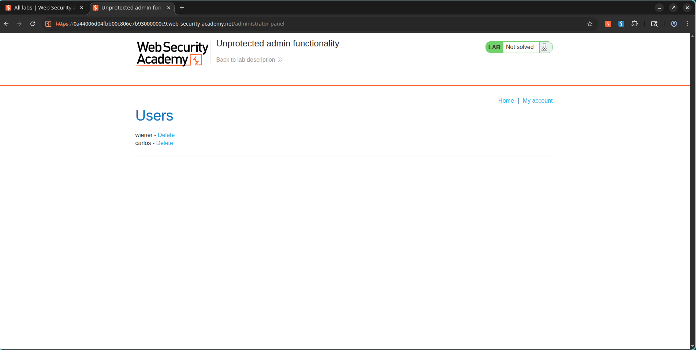
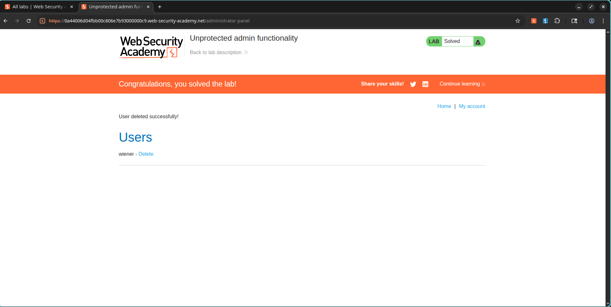

# Lab: Unprotected Admin Functionality

## Lab Information

* **Category:** Access Control
* **Level:** Apprentice
* **Lab:** Unprotected Admin Functionality
* **Status:** Solved

---

## Objective

Gain access to an unprotected administrator panel and delete the user:

```text
carlos
```

---

## Vulnerability Overview

The application exposes administrative functionality without implementing proper access control.

Sensitive administrative endpoints are disclosed through the `robots.txt` file, allowing an attacker to directly access privileged functionality.

---

## Exploitation Steps

### 1. Discover Hidden Administrative Endpoint

The `robots.txt` file was accessed:

```text
/robots.txt
```

The file disclosed a restricted administrative path:

```text
Disallow: /administrator-panel
```

### Screenshot


---

### 2. Access the Administrator Panel

The disclosed endpoint was visited directly:

```text
/administrator-panel
```

The application allowed unrestricted access to the administrator interface.

### Screenshot



---

### 3. Delete the Target User

Within the administrator panel, the user:

```text
carlos
```

was located and deleted using the available administrative functionality.

---

## Result

The target user was successfully deleted and the lab was marked as solved.

### Screenshot



---

## Impact

An attacker can:

* Access sensitive administrative functionality.
* Perform privileged operations without authentication.
* Modify or delete application data.
* Compromise the integrity of the application.

---

## Remediation

* Implement server-side authorization checks on all administrative endpoints.
* Do not rely on obscurity or hidden URLs for security.
* Restrict access to administrative functionality based on user roles.
* Regularly audit exposed endpoints and sensitive resources.

---

## Key Learning Points

* Administrative endpoints must always enforce authorization.
* `robots.txt` should never contain sensitive paths.
* Hidden URLs are not a security control.
* Access control must be validated on every request.

---

## References

* PortSwigger Web Security Academy
* OWASP Access Control Cheat Sheet
* OWASP Top 10 – Broken Access Control
