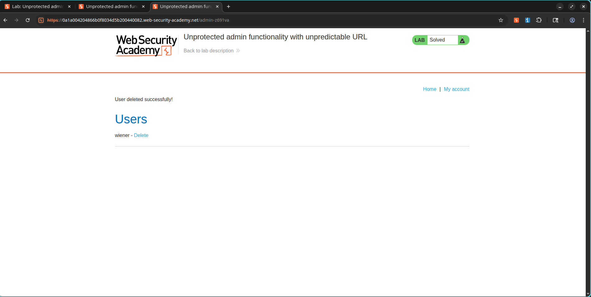

# Lab: Unprotected Admin Functionality with Unpredictable URL

## Lab Information

* **Category:** Access Control
* **Level:** Apprentice
* **Lab:** Unprotected Admin Functionality with Unpredictable URL
* **Status:** Solved

---

## Objective

Identify a hidden administrator panel exposed through client-side code and use it to delete the user:

```text
carlos
```

---

## Vulnerability Overview

The application attempts to hide administrative functionality by placing it at an unpredictable URL.

However, the URL is disclosed within the application's source code, making it discoverable by any user. Since the administrator panel lacks proper access controls, an attacker can directly access privileged functionality.

---

## Exploitation Steps

### 1. Review the Application Source Code

The homepage source code was inspected using:

```text
Ctrl + U
```

Within the JavaScript code, the hidden administrator panel URL was disclosed:

```javascript
adminPanelTag.setAttribute('href', '/admin-z691va');
```

This revealed the location of the administrative interface.

### Screenshot


---

### 2. Access the Administrator Panel

Using the discovered path, the administrator panel was accessed directly:

```text
/admin-z691va
```

The application granted unrestricted access to administrative functionality.

---

### 3. Delete the Target User

The administrator interface contained user management functionality.

The user:

```text
carlos
```

was located and deleted through the exposed administration panel.

---

## Result

The target user was successfully deleted and the lab was marked as solved.

### Screenshot



---

## Impact

An attacker can:

* Discover hidden administrative functionality.
* Bypass intended restrictions.
* Access privileged operations.
* Modify or delete sensitive application data.

---

## Remediation

* Enforce server-side authorization checks on all administrative endpoints.
* Do not rely on hidden or unpredictable URLs for security.
* Restrict privileged functionality using role-based access control.
* Remove sensitive administrative references from client-side code.

---

## Key Learning Points

* Hidden URLs are not an access control mechanism.
* Client-side code should never contain sensitive administrative paths.
* Authorization must always be validated on the server.
* Security through obscurity should never be relied upon.

---

## References

* PortSwigger Web Security Academy
* OWASP Access Control Cheat Sheet
* OWASP Top 10 – Broken Access Control
