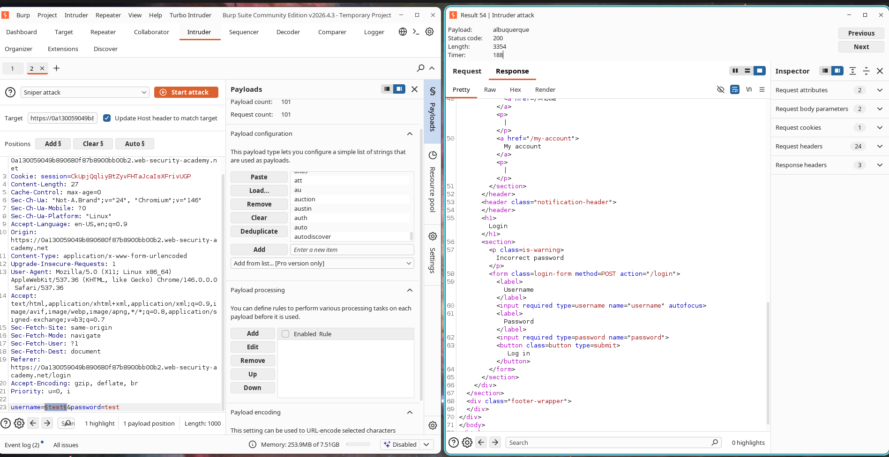
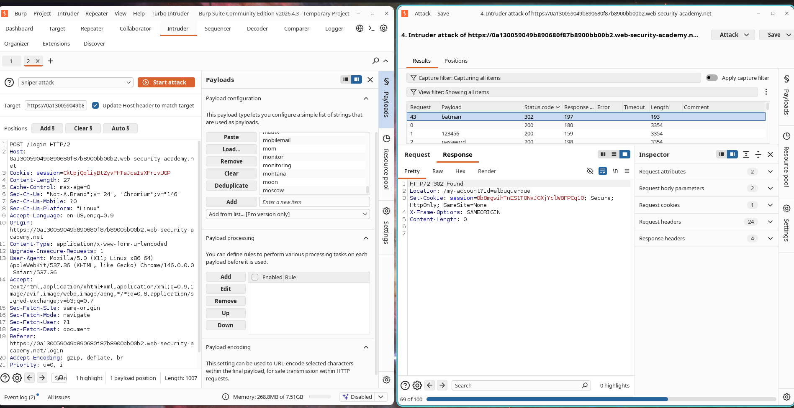
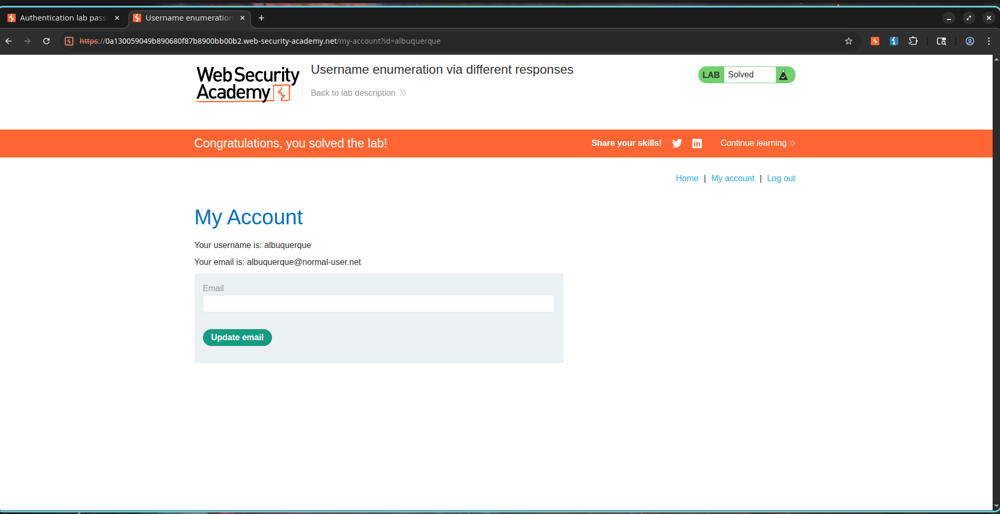

# Username Enumeration via Different Responses

## Description

The application is vulnerable to username enumeration due to inconsistent authentication error messages. During the login process, the application returns different responses depending on whether the supplied username exists in the system.

When an invalid username is submitted, the application responds with:

```text
Invalid username
```

However, when a valid username is submitted with an incorrect password, the application responds with:

```text
Incorrect password
```

This behavior allows an attacker to identify valid usernames through response analysis. Once a valid username is discovered, the attacker can perform targeted password brute-force attacks against that account.

---

## Steps to Exploit

### Phase 1: Username Enumeration

1. Navigate to the login page.
2. Submit a login request using arbitrary credentials.
3. Intercept the request using Burp Suite.
4. Send the request to Burp Intruder.
5. Place the payload position on the `username` parameter.
6. Load the provided candidate username list.
7. Launch the Intruder attack.
8. Compare response lengths and response messages.
9. Identify the username that produces the response:

```text
Incorrect password
```

10. Record the discovered username.

### Phase 2: Password Discovery

1. Replace the username parameter with the discovered valid username.
2. Place the payload position on the `password` parameter.
3. Load the provided candidate password list.
4. Launch the Intruder attack.
5. Observe the response status codes.
6. Identify the password that results in:

```text
302 Found
```

7. Record the discovered password.

### Phase 3: Authentication

1. Navigate to the login page.
2. Login using the discovered credentials.
3. Access the user account page.
4. Successfully solve the lab.

---

## Proof of Concept

### Valid Username Identified

```text
albuquerque
```

### Valid Password Identified

```text
batman
```

### Enumeration Indicator

Invalid users generated:

```text
Invalid username
```

Valid user generated:

```text
Incorrect password
```

### Authentication Indicator

Successful login generated:

```http
HTTP/2 302 Found
Location: /my-account?id=albuquerque
```

---

## Screenshots

### Screenshot 1 – Username Enumeration

**Description:**

Burp Intruder attack against candidate usernames. The response for the username `albuquerque` differs from all other responses and contains the message:

```text
Incorrect password
```

indicating that the username exists within the application.



---

### Screenshot 2 – Password Discovery

**Description:**

Burp Intruder attack against candidate passwords for the identified username. The password `batman` generated a `302 Found` response, indicating successful authentication.



---

### Screenshot 3 – Successful Authentication

**Description:**

Successful login using the identified credentials and completion of the PortSwigger lab.



---

## Impact

* Disclosure of valid usernames.
* Enables targeted password brute-force attacks.
* Reduces attack complexity for authentication attacks.
* Increases the likelihood of account compromise.
* May lead to unauthorized access to sensitive user data.
* Can facilitate privilege escalation if administrative accounts are identified.

---

## Mitigation / Remediation

1. Return generic authentication error messages for all login failures.

Example:

```text
Invalid username or password
```

2. Implement account lockout policies after multiple failed login attempts.
3. Enforce strong password policies.
4. Enable Multi-Factor Authentication (MFA).
5. Implement rate limiting on authentication endpoints.
6. Monitor and alert on suspicious authentication activity.
7. Use CAPTCHA mechanisms where appropriate.

---

## CVSS Score

**CVSS v3.1 Score:** 5.3 (Medium)

### Vector

```text
CVSS:3.1/AV:N/AC:L/PR:N/UI:N/S:U/C:L/I:N/A:N
```

---

## CVSS Justification

### Attack Vector

Network (N) – Exploitable remotely via web requests.

### Attack Complexity

Low (L) – No special conditions are required.

### Privileges Required

None (N) – No authentication is needed.

### User Interaction

None (N) – No victim interaction is required.

### Scope

Unchanged (U) – Impact remains within the vulnerable application.

### Confidentiality Impact

Low (L) – Valid usernames can be disclosed.

### Integrity Impact

None (N) – No data modification occurs.

### Availability Impact

None (N) – No disruption to service is required.

---

## References

* OWASP Authentication Cheat Sheet
* OWASP Credential Stuffing Prevention Cheat Sheet
* PortSwigger Web Security Academy – Username Enumeration via Different Responses
