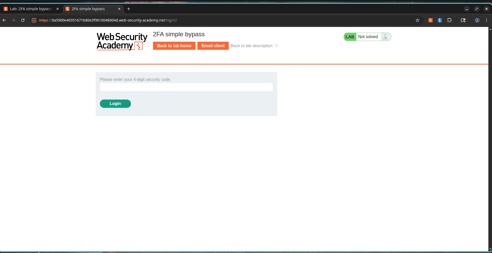
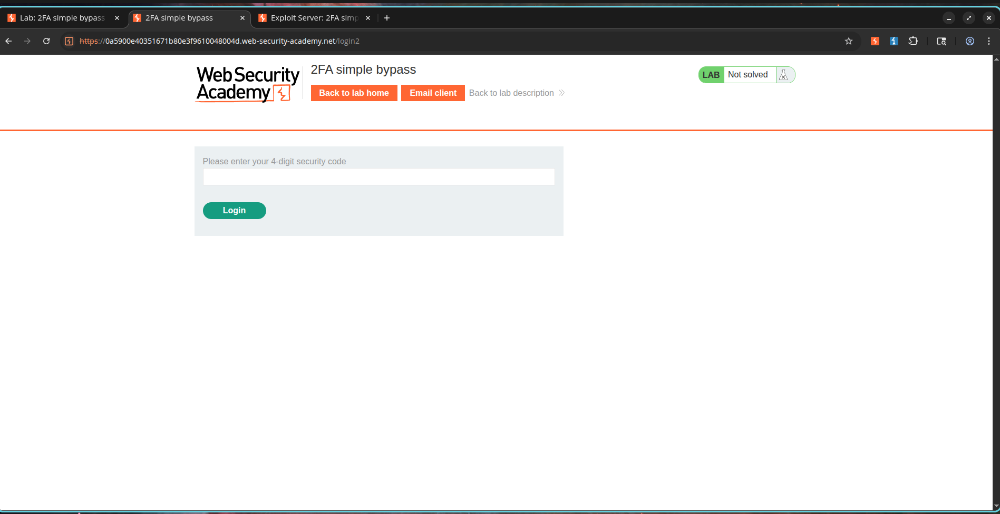
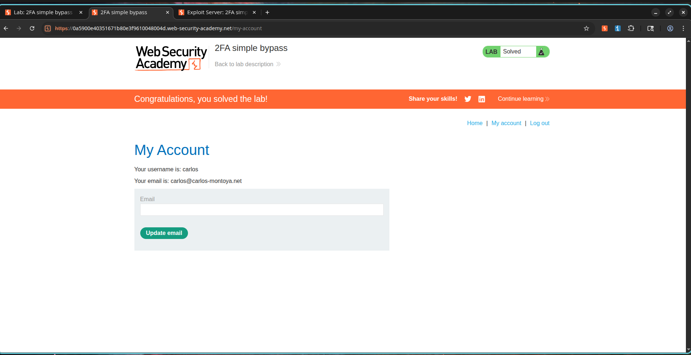

# 2FA Simple Bypass

## Description

The application implements two-factor authentication (2FA) as an additional security layer after successful username and password authentication. However, the implementation is flawed because access control does not properly enforce completion of the second authentication factor before granting access to protected resources.

After submitting valid credentials, users are redirected to a 2FA verification page where a security code is expected. By directly navigating to the account page URL before completing the verification step, an attacker can bypass the 2FA mechanism entirely and gain unauthorized access to protected accounts.

This vulnerability defeats the purpose of multi-factor authentication and allows attackers who possess valid credentials to access user accounts without the second authentication factor.

---

## Steps to Exploit

### Phase 1: Normal Authentication Flow

1. Navigate to the login page.
2. Login using valid credentials:

```text
Username: wiener
Password: peter
```

3. Observe that the application redirects the user to a 2FA verification page.
4. Retrieve the verification code from the email client.
5. Submit the code and access the account page.

---

### Phase 2: 2FA Bypass

1. Log out of the application.
2. Login using the victim credentials:

```text
Username: carlos
Password: montoya
```

3. Observe that the application redirects to the 2FA verification page.
4. Do not enter the verification code.
5. Manually modify the URL from:

```text
/login2
```

to:

```text
/my-account
```

6. Press Enter.
7. Observe that access is granted to the victim's account without completing the second authentication factor.

---

## Proof of Concept

### Valid Credentials

```text
Username: carlos
Password: montoya
```

### Expected Secure Flow

```text
Login
   ↓
2FA Verification
   ↓
Account Access
```

### Actual Vulnerable Flow

```text
Login
   ↓
2FA Verification
   ↓
Direct URL Access (/my-account)
   ↓
Account Access Granted
```

### Vulnerable Resource

```http
GET /my-account HTTP/2
```

The application fails to verify whether the user has successfully completed the second authentication factor before granting access to the protected account page.

---

## Screenshots

### Screenshot 1 – Normal 2FA Verification Page

**Description:**

After successful login using valid credentials, the application redirects the user to the 2FA verification page and requests a security code.



---

### Screenshot 2 – Victim Account 2FA Challenge

**Description:**

The victim account (`carlos`) is redirected to the same 2FA verification page after successful credential validation.



---

### Screenshot 3 – Successful 2FA Bypass

**Description:**

The attacker manually navigates to the account page without providing a valid security code and successfully gains access to the protected account.



---

## Impact

* Complete bypass of multi-factor authentication.
* Unauthorized access to user accounts.
* Increased risk of account takeover.
* Reduced effectiveness of authentication security controls.
* Exposure of sensitive user information.
* Potential privilege escalation if administrative accounts are targeted.

---

## Mitigation / Remediation

1. Enforce server-side validation of the 2FA completion state.
2. Verify successful second-factor authentication before granting access to protected resources.
3. Associate authentication state with server-side sessions.
4. Restrict direct access to protected endpoints until 2FA verification is completed.
5. Implement centralized authorization checks across all authenticated routes.
6. Perform regular authentication security reviews and penetration testing.

---

## CVSS Score

**CVSS v3.1 Score:** 8.1 (High)

### Vector

```text
CVSS:3.1/AV:N/AC:L/PR:N/UI:N/S:U/C:H/I:H/A:N
```

---

## CVSS Justification

### Attack Vector

Network (N) – Exploitable remotely through web requests.

### Attack Complexity

Low (L) – The bypass requires only URL manipulation.

### Privileges Required

None (N) – The attacker only requires valid credentials, which are assumed compromised.

### User Interaction

None (N) – No victim interaction is required.

### Scope

Unchanged (U) – Impact remains within the vulnerable application.

### Confidentiality Impact

High (H) – Sensitive account information can be accessed.

### Integrity Impact

High (H) – Unauthorized actions can be performed on behalf of the victim.

### Availability Impact

None (N) – The attack does not affect service availability.

---

## References

* OWASP Multifactor Authentication Cheat Sheet
* OWASP Authentication Cheat Sheet
* PortSwigger Web Security Academy – 2FA Simple Bypass
