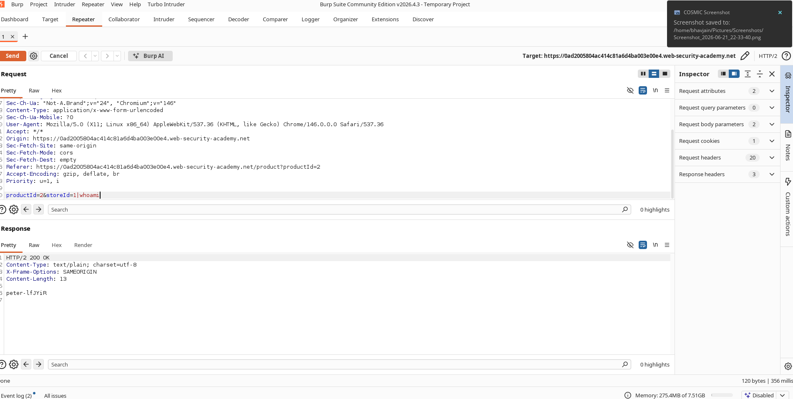
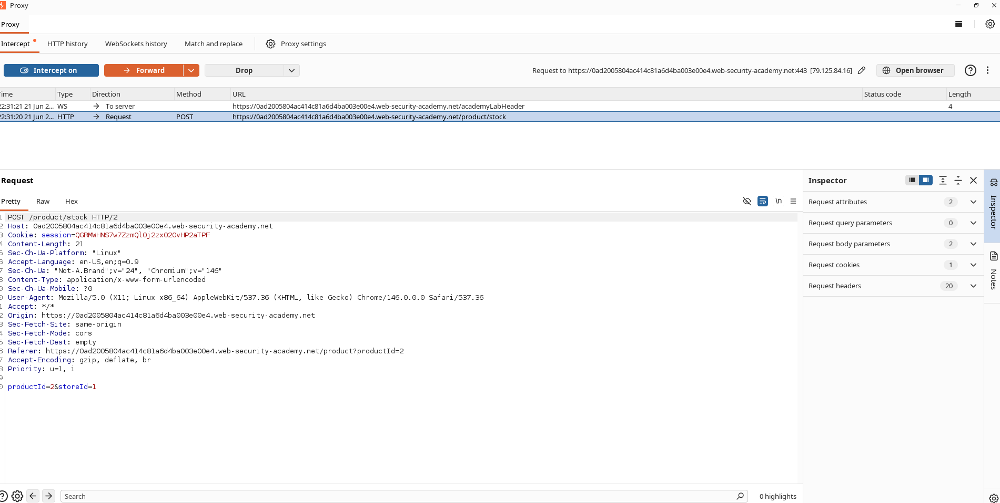

# OS Command Injection – Simple Case

## Lab Information

**Lab:** OS Command Injection – Simple Case  
**Category:** OS Command Injection  
**Difficulty:** Apprentice  
**Status:** Solved

## Objective

The application contains an OS command injection vulnerability in the stock checker functionality. The goal is to execute the `whoami` command and identify the user account under which the web server is running.

---

## Vulnerability Overview

The stock checker passes user-controlled input directly to a system command without proper sanitization.

By injecting shell metacharacters into the `storeId` parameter, arbitrary operating system commands can be executed.

---

## Exploitation Steps

1. Open a product page.
2. Click **Check Stock** and intercept the request using Burp Suite.
3. Send the request to Repeater.
4. Modify the `storeId` parameter by appending the `whoami` command.
5. Send the modified request.
6. Observe the command output in the response.
7. The application returns the username of the current system user, confirming successful command execution.

---

## Payload Used

```text
1|whoami
```

---

## Result

The application executed the injected command and returned the username of the operating system user running the web application.

This confirms the presence of an OS Command Injection vulnerability.

---

## Screenshots

### Command Execution



### Lab Solved



---

## Security Impact

An attacker can execute arbitrary operating system commands on the target server.

Possible impacts include:

- Information disclosure
- File system access
- Credential theft
- Remote code execution
- Complete server compromise

---

## Remediation

- Avoid invoking OS commands with user-controlled input.
- Use safe APIs instead of shell execution.
- Validate and sanitize all user input.
- Implement allowlists for expected parameter values.
- Run services with least-privileged accounts.

---

## Key Takeaway

Never pass user input directly into operating system commands. Even a simple parameter such as `storeId` can be abused to achieve arbitrary command execution if proper input validation is not enforced.