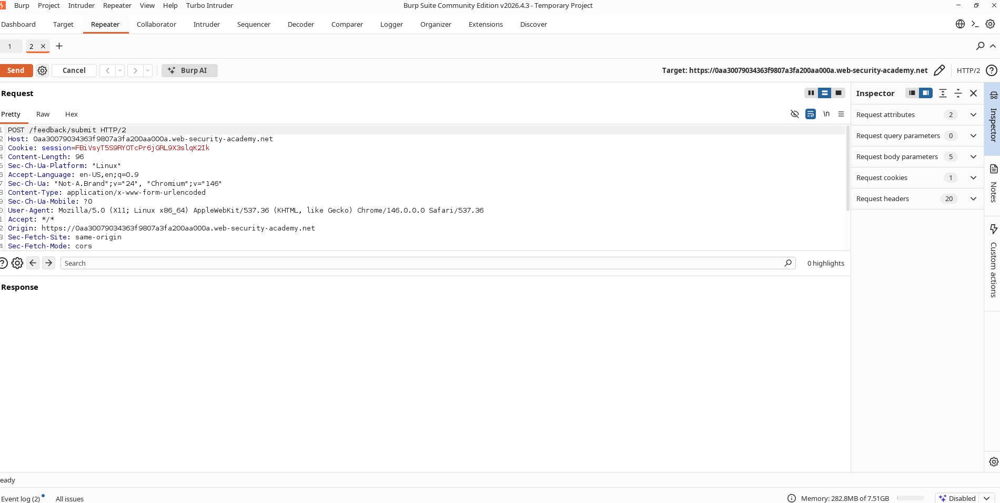
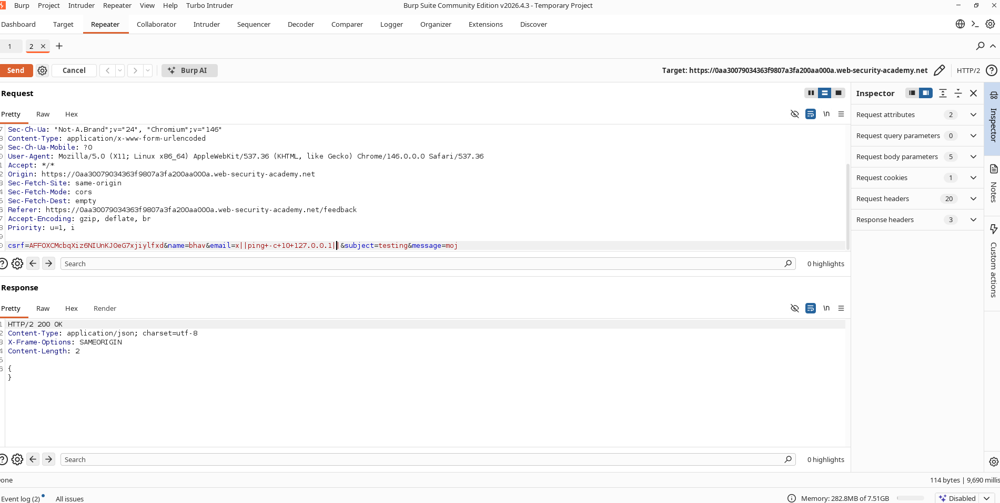
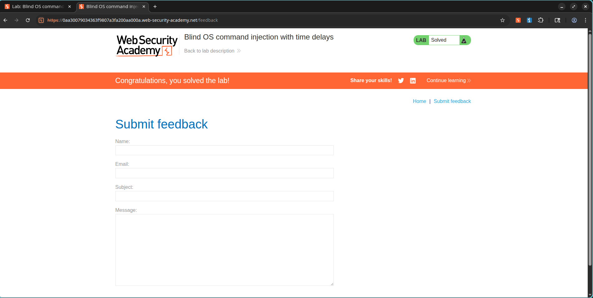

# Blind OS Command Injection with Time Delays

## Lab Information

**Lab:** Blind OS Command Injection with Time Delays
**Category:** OS Command Injection
**Difficulty:** Practitioner
**Status:** Solved

## Objective

The application contains a blind OS command injection vulnerability in the feedback functionality.

Unlike traditional command injection, the output of executed commands is not returned in the HTTP response. The objective is to confirm command execution by causing a measurable time delay.

---

## Vulnerability Overview

The application executes operating system commands using user-supplied input from the feedback form without proper sanitization.

Because command output is not displayed, exploitation is confirmed through a side effect—in this case, a delayed server response.

---

## Exploitation Steps

1. Open the feedback form.
2. Submit a normal request and intercept it using Burp Suite.
3. Send the request to Repeater.
4. Modify the `email` parameter to inject a command that introduces a delay.
5. Send the modified request.
6. Observe that the server response takes approximately 10 seconds longer than normal.
7. The delay confirms successful command execution and solves the lab.

---

## Payload Used

```text
x||ping+-c+10+127.0.0.1||
```

---

## Explanation

The injected payload executes:

```bash
ping -c 10 127.0.0.1
```

This causes the server to spend approximately 10 seconds processing the request before returning a response.

Because the response is delayed, command execution can be inferred even though the output is not displayed.

---

## Result

The server response was delayed by approximately 10 seconds, confirming successful execution of the injected operating system command.

The lab was successfully solved.

---

## Screenshots

### Original Feedback Request



### Time Delay Observed



### Lab Solved



---

## Security Impact

Blind OS command injection can allow attackers to:

* Execute arbitrary operating system commands
* Read sensitive files
* Establish persistence
* Perform privilege escalation
* Gain complete control of the affected server

Even when command output is hidden, attackers can use timing-based techniques to confirm successful exploitation.

---

## Remediation

* Avoid passing user-controlled input to shell commands.
* Use safe APIs instead of shell execution.
* Validate and sanitize all user input.
* Apply allowlist validation wherever possible.
* Run services with least privileges.
* Monitor for unusual delays and command execution patterns.

---

## Key Takeaway

Blind command injection vulnerabilities are still highly dangerous even when command output is not visible. Timing-based payloads can be used to reliably verify and exploit command execution.
