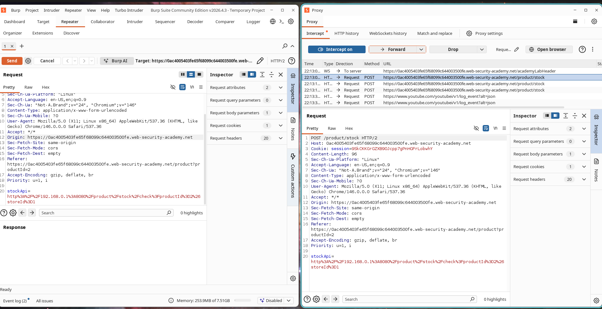
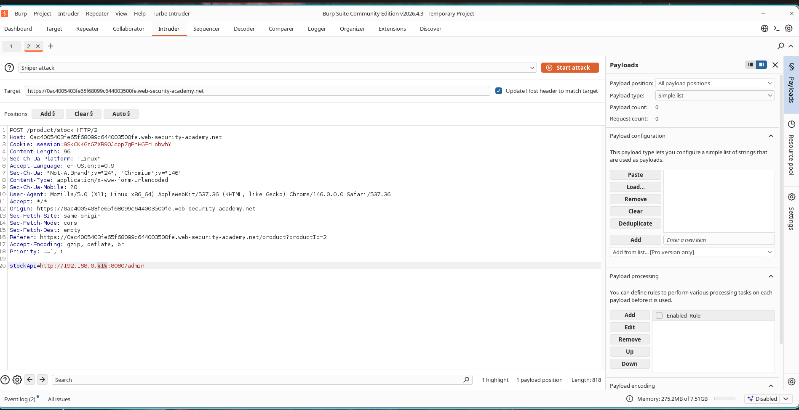
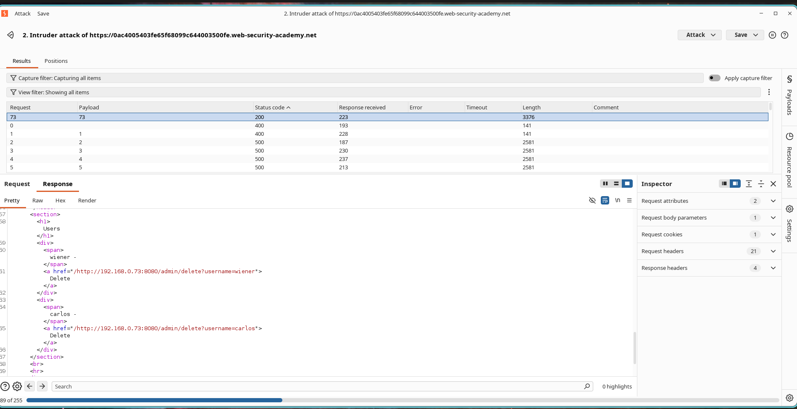
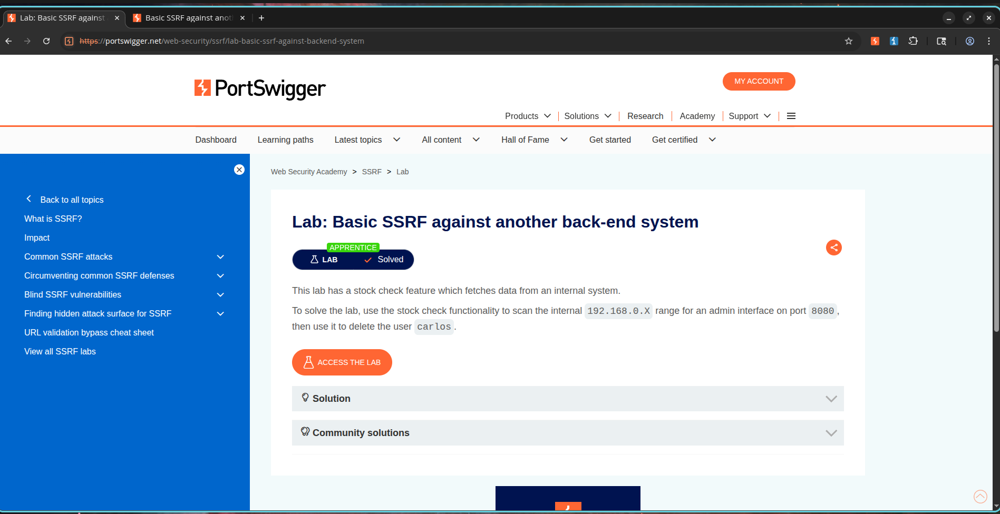

# Basic SSRF Against Another Back-End System

## Lab Information

* **Category:** Server-Side Request Forgery (SSRF)
* **Lab Name:** Basic SSRF Against Another Back-End System
* **Difficulty:** Apprentice
* **Status:** Solved

---

## Objective

The application contains a stock-check functionality that fetches data from an internal system.

The objective of this lab is to exploit the SSRF vulnerability to scan the internal network, identify an administrative interface running on the `192.168.0.X` range, and use it to delete the user **carlos**.

---

## Vulnerability Overview

Server-Side Request Forgery (SSRF) occurs when an application makes server-side requests to URLs supplied by the user.

This allows attackers to:

* Access internal systems
* Interact with services not exposed to the internet
* Perform internal network reconnaissance
* Reach administrative interfaces
* Access sensitive internal resources

In this lab, the vulnerable `stockApi` parameter can be manipulated to force the server to access internal IP addresses.

---

## Exploitation Steps

### Step 1 - Intercept Stock Check Request

1. Open any product page.
2. Click **Check Stock**.
3. Intercept the request in Burp Suite.
4. Send the request to Intruder.

Example vulnerable parameter:

```http
stockApi=http://stock.weliketoshop.net:8080/product/stock/check?productId=1&storeId=1
```

### Screenshot



---

### Step 2 - Configure Internal Network Scan

Modify the URL to target the internal subnet:

```http
stockApi=http://192.168.0.1:8080/admin
```

Highlight the last octet of the IP address and configure Intruder to brute-force values from:

```text
1 - 255
```

using the **Numbers** payload type.

### Screenshot



---

### Step 3 - Discover Internal Administration Interface

Start the Intruder attack and analyze the responses.

Most responses return error codes; however, one host responds with a successful status code indicating the presence of an administration interface.

The successful response reveals the admin panel and contains functionality for deleting users.

### Screenshot



---

### Step 4 - Delete User Carlos

Using the identified internal host, modify the request to target:

```http
/admin/delete?username=carlos
```

The server performs the request internally and deletes the target user.

---

### Step 5 - Lab Solved

After deleting the user **carlos**, the lab is automatically marked as solved.

### Screenshot



---

## Impact

Successful SSRF vulnerabilities can allow attackers to:

* Scan internal networks
* Access hidden administrative interfaces
* Bypass firewall restrictions
* Interact with internal-only services
* Escalate privileges
* Access cloud metadata services

In real-world environments, SSRF is often used as a pivot point for deeper infrastructure compromise.

---

## Remediation

To mitigate SSRF vulnerabilities:

1. Implement strict allowlists for outbound requests.
2. Block access to localhost and private IP ranges.
3. Restrict access to internal administrative interfaces.
4. Validate and sanitize user-supplied URLs.
5. Use network segmentation.
6. Monitor and log outbound requests.

---

## Conclusion

The stock-check functionality trusted user-controlled URLs without sufficient validation. By manipulating the `stockApi` parameter, it was possible to perform internal network reconnaissance, discover a hidden administration interface, and execute privileged actions, ultimately leading to successful exploitation of the SSRF vulnerability.
