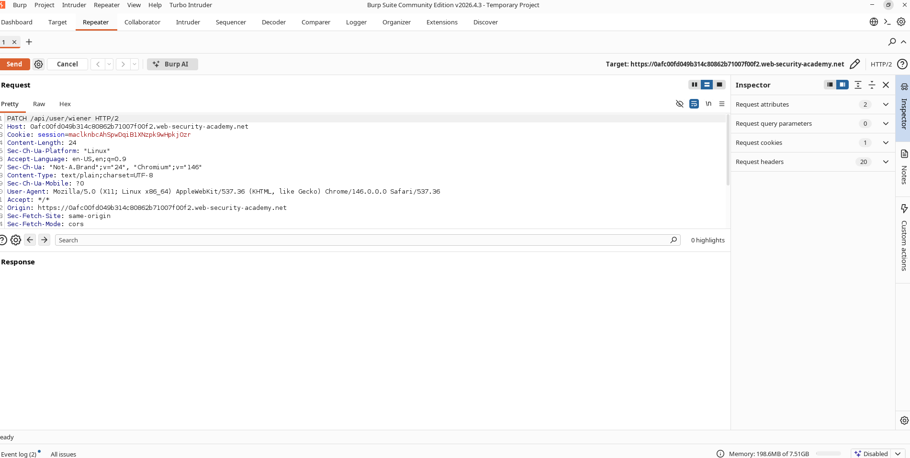
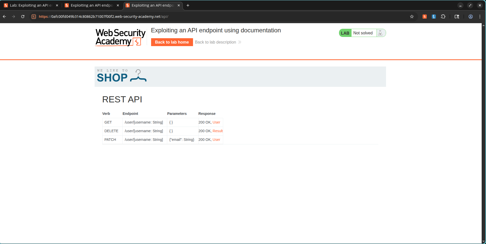
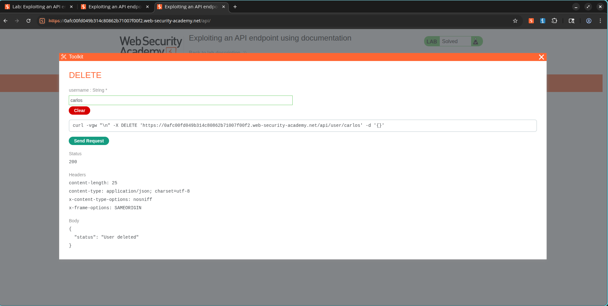

# Lab: Exploiting an API Endpoint Using Documentation

## Lab Information

- **Lab Name:** Exploiting an API endpoint using documentation
- **Category:** API Testing
- **Difficulty:** Apprentice
- **Platform:** PortSwigger Web Security Academy

## Objective

The goal of this lab was to discover exposed API documentation, identify available API endpoints, and use the documented functionality to delete the user `carlos`.

---

## Vulnerability Overview

Applications often expose API documentation for development and integration purposes. If this documentation is publicly accessible, it can reveal sensitive endpoints and functionality that attackers can abuse.

In this lab, API documentation exposed a privileged endpoint capable of deleting users.

---

## Attack Methodology

### Step 1: Capture an API Request

Logged in using the provided credentials:

```text
Username: wiener
Password: peter
```

Updated the email address from the account page and captured the resulting API request.

### Evidence



---

### Step 2: Discover API Documentation

The captured request targeted:

```http
PATCH /api/user/wiener
```

By modifying the endpoint path and exploring the API structure, the exposed API documentation endpoint was discovered.

The documentation revealed available API operations and request formats.

### Evidence



---

### Step 3: Abuse Documented Functionality

Using the interactive API documentation, the following endpoint was identified:

```http
DELETE /api/user/{username}
```

The username parameter was supplied with:

```text
carlos
```

The request successfully deleted the target account.

---

## Result

The privileged API functionality was accessible through exposed documentation, allowing deletion of arbitrary users.

### Evidence



---

## Impact

Exposed API documentation can significantly aid attackers by:

- Revealing hidden endpoints
- Exposing administrative functionality
- Providing request formats and parameters
- Simplifying endpoint enumeration
- Enabling privilege escalation and unauthorized actions

---

## Key Takeaways

- API documentation should not be publicly accessible unless required.
- Administrative API endpoints must enforce proper authorization checks.
- Hidden functionality should not rely on obscurity for protection.
- Regular API security reviews should include documentation exposure assessments.

---

## Screenshots Used

```text
images/
├── api_user_request.png
├── api_documentation.png
└── lab_solved.png
```

## Lab Status

✅ Solved