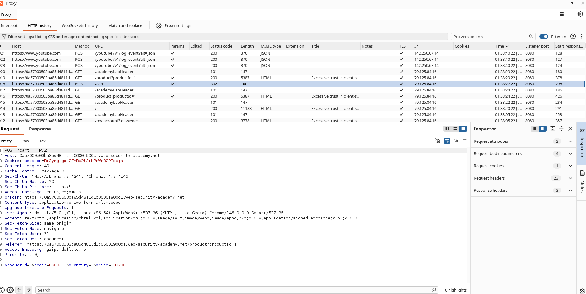
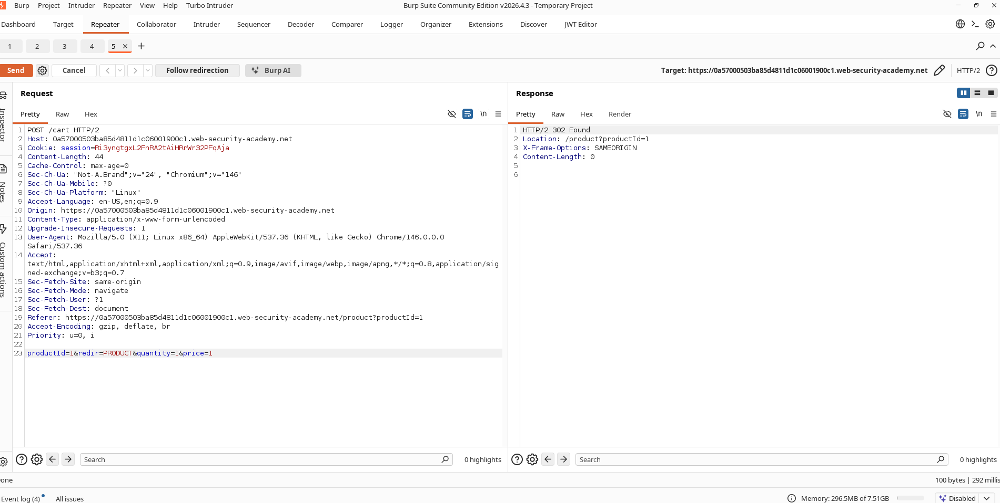
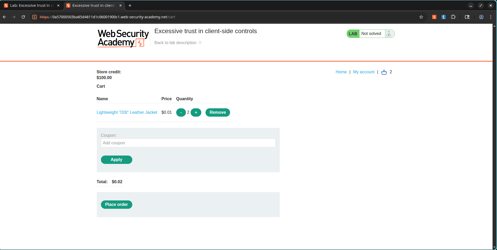
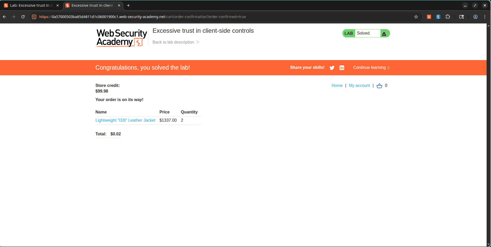

# Lab: Excessive Trust in Client-Side Controls

## Lab Information

**Category:** Business Logic Vulnerabilities  
**Difficulty:** Apprentice  
**Lab URL:** https://portswigger.net/web-security/logic-flaws/examples/lab-logic-flaws-excessive-trust-in-client-side-controls

---

## Objective

Exploit a business logic flaw in the purchasing workflow to buy the **"Lightweight l33t leather jacket"** for a manipulated price by modifying a client-controlled parameter.

---

## Vulnerability Overview

The application trusts a price value supplied by the client when adding products to the shopping cart.

Instead of validating or recalculating the price on the server side, the application accepts the user-supplied value, allowing attackers to purchase products at arbitrary prices.

---

## Steps Performed

### 1. Login

Login using the provided credentials:

```text
Username: wiener
Password: peter
```

Navigate to the online store.

---

### 2. Add the Jacket to the Cart

Open the product:

```text
Lightweight l33t leather jacket
```

Click:

```text
Add to Cart
```

Intercept or inspect the request in Burp Suite.

---

### 3. Identify the Vulnerable Parameter

In Burp Suite:

```text
Proxy → HTTP History
```

Locate the request:

```http
POST /cart
```

Example request body:

```http
productId=1&redir=PRODUCT&quantity=1&price=133700
```

Notice that the client sends a price parameter.

### Screenshot



---

### 4. Send the Request to Repeater

Right-click the request and select:

```text
Send to Repeater
```

---

### 5. Manipulate the Product Price

Modify:

```text
price=133700
```

to:

```text
price=1
```

Modified request:

```http
productId=1&redir=PRODUCT&quantity=1&price=1
```

Send the request.

The server accepts the modified value.

### Screenshot



---

### 6. Verify the Cart Price

Return to the browser and refresh the shopping cart.

The jacket price is now displayed using the attacker-controlled value.

Example:

```text
$0.01
```

### Screenshot



---

### 7. Purchase the Product

Since the manipulated price is below the available store credit, proceed with checkout.

Click:

```text
Place Order
```

The purchase completes successfully.

### Screenshot


---

### 8. Verify Lab Completion

After successfully purchasing the jacket, the lab is marked as solved.

### Screenshot



---

## Root Cause

The application relies on a client-supplied parameter:

```http
price
```

to determine the final purchase amount.

Because the server fails to verify or recalculate the actual product price, attackers can manipulate the value and purchase items at arbitrary prices.

---

## Impact

An attacker can:

- Purchase products at heavily discounted prices.
- Bypass intended payment restrictions.
- Cause financial losses.
- Manipulate transaction values.
- Abuse business logic for unauthorized gains.

---

## Remediation

1. Never trust price-related values supplied by clients.
2. Calculate product prices exclusively on the server.
3. Ignore client-provided pricing parameters.
4. Validate order totals before checkout.
5. Implement server-side integrity checks for transactions.

---

## Key Learning

Security controls implemented solely on the client side can be bypassed. Sensitive values such as prices, discounts, balances, and permissions must always be validated and enforced on the server side.