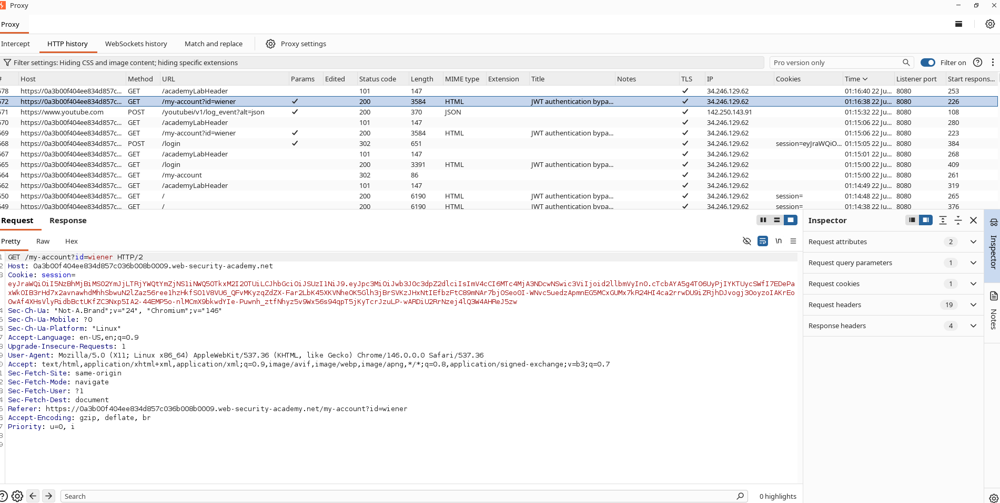
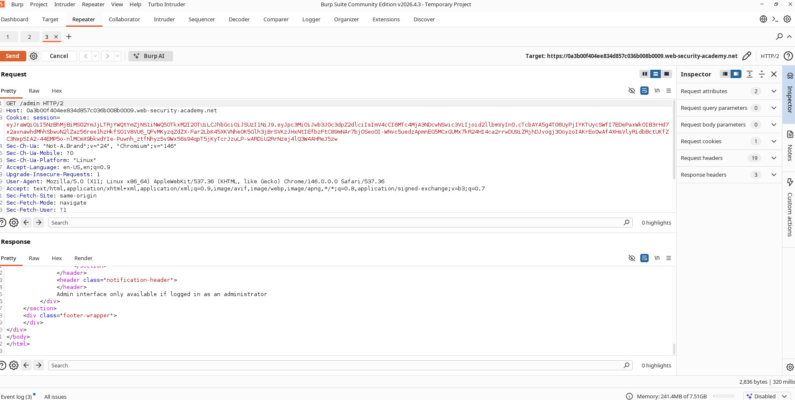
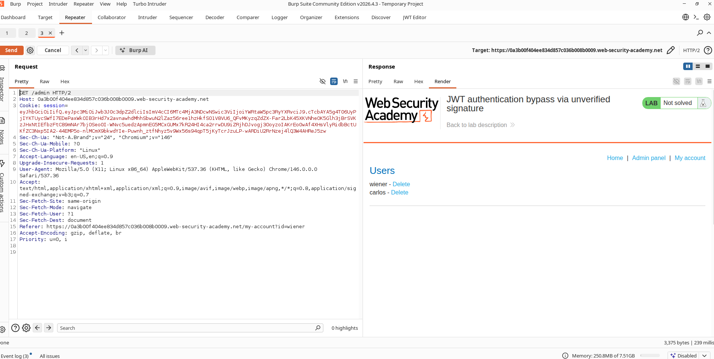
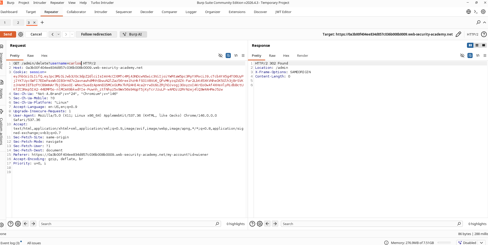
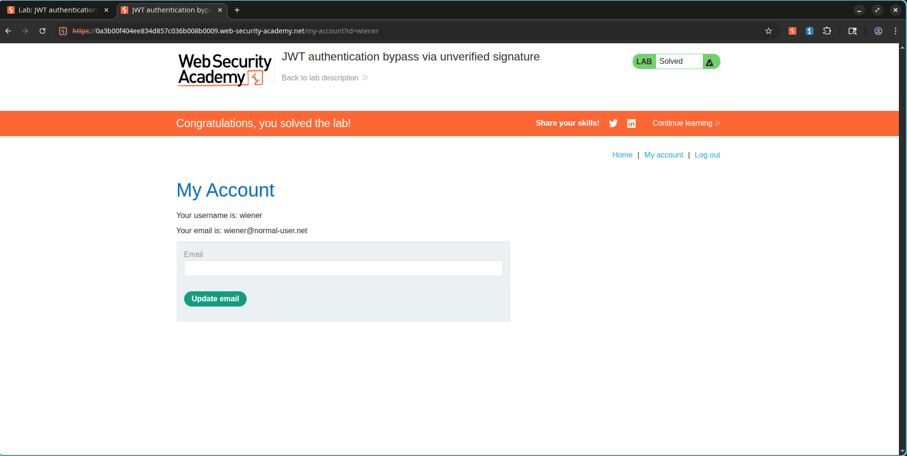

# Lab: JWT Authentication Bypass via Unverified Signature

## Lab Information

**Category:** JWT Attacks  
**Difficulty:** Apprentice  
**Lab URL:** https://portswigger.net/web-security/jwt/lab-jwt-authentication-bypass-via-unverified-signature

## Objective

Exploit a JWT implementation flaw where the server does not verify JWT signatures. Modify the JWT payload to impersonate the administrator account, access the admin panel, and delete the user `carlos`.

---

## Vulnerability Overview

The application uses JWTs for session management. However, the backend fails to verify the JWT signature before trusting the claims contained within the token.

As a result, an attacker can modify the payload section of the JWT and elevate privileges without possessing the signing key.

---

## Steps Performed

### 1. Login with Valid Credentials

Login using:

```text
Username: wiener
Password: peter
```

Navigate to:

```text
My Account
```

Capture the authenticated request containing the JWT session cookie.

---

### 2. Inspect the JWT

Open the authenticated request in Burp Suite.

Locate the JWT stored in the session cookie.

Decode the token and inspect the payload.

Original payload:

```json
{
  "iss": "portswigger",
  "exp": 1782074705,
  "sub": "wiener"
}
```

### Screenshot



---

### 3. Attempt to Access Admin Panel

Modify the request path:

```http
GET /admin HTTP/2
```

Send the request using the original JWT.

The application returns:

```http
401 Unauthorized
```

because the current user is not an administrator.

### Screenshot



---

### 4. Modify the JWT Payload

Change the value of the `sub` claim:

From:

```json
"sub": "wiener"
```

To:

```json
"sub": "administrator"
```

Because the application does not validate the JWT signature, the modified token is still accepted.

---

### 5. Access the Admin Panel

Resend the request:

```http
GET /admin HTTP/2
```

The application grants administrative access.

### Screenshot



---

### 6. Delete Carlos

Locate the delete endpoint:

```http
/admin/delete?username=carlos
```

Send the request.

The application deletes the user successfully.

### Screenshot



---

### 7. Verify Lab Completion

After deleting Carlos, the lab is marked as solved.

### Screenshot



---

## Root Cause

The application trusted JWT claims without validating the token signature.

This allowed modification of sensitive claims such as:

```json
{
  "sub": "administrator"
}
```

without possession of the signing key.

---

## Impact

An attacker can:

- Escalate privileges
- Impersonate arbitrary users
- Access administrative functionality
- Bypass authentication controls
- Perform unauthorized actions

---

## Remediation

1. Always verify JWT signatures before processing claims.
2. Reject unsigned tokens.
3. Reject tokens with modified payloads.
4. Use secure JWT libraries.
5. Restrict sensitive actions using server-side authorization checks.

---

## Key Learning

JWT contents should never be trusted unless the token signature has been validated. Failure to verify signatures allows attackers to forge arbitrary identities and gain unauthorized access.