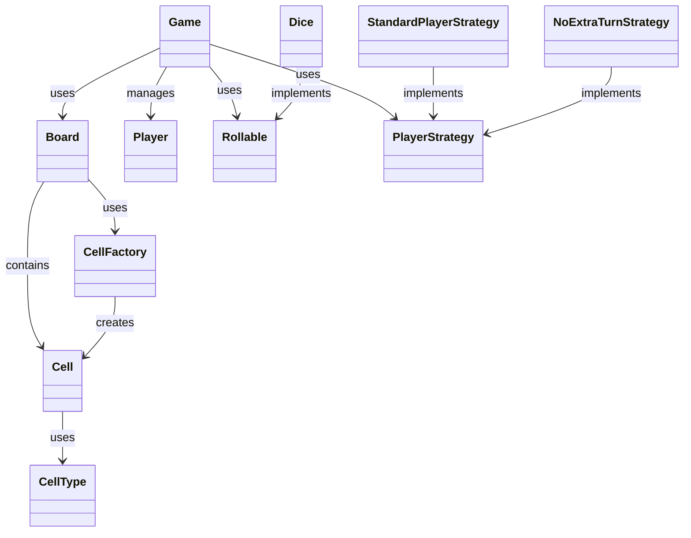

# Snake and Ladder Game 🎲🐍🪜

A Java implementation of the classic Snake and Ladder game, built with **SOLID principles** and **design patterns** for maintainability, scalability, and code quality.

---

## 📑 Table of Contents

- [Overview](#overview)
- [Applied Principles](#applied-principles)
- [Design Patterns](#design-patterns)
- [Project Structure](#project-structure)
- [UML Diagram](#uml-diagram)
- [Key Components](#key-components)
- [How to Run](#how-to-run)
- [Example](#example)
- [Future Enhancements](#future-enhancements)
- [Design Decisions](#design-decisions)

---

## 📌 Overview

This project demonstrates the **Snake and Ladder game** implemented using **object-oriented design principles**.

Key features:

- Multiple players and strategies
- Configurable board with snakes and ladders
- Extensible design with SOLID principles
- Use of Factory, Strategy, and Template Method patterns

---

## 🧩 Applied Principles

### 1. **Single Responsibility (SRP)**

Each class handles one concern:

- `Player`: Player state (name, position, moves)
- `Board`: Board setup and movement logic
- `Dice`: Dice roll logic
- `Game`: Game flow and turn management
- `Cell` & `CellFactory`: Represent and create board cells

### 2. **Open/Closed (OCP)**

Easily extend functionality without modifying existing code:

- Add new `PlayerStrategy` implementations
- Create new dice types with `Rollable`
- Introduce new `CellType` values

### 3. **Liskov Substitution (LSP)**

Interfaces ensure substitutability:

- Any `Rollable` can replace `Dice`
- Any `PlayerStrategy` can replace existing strategies

### 4. **Interface Segregation (ISP)**

Focused, client-specific interfaces:

- `Rollable`: Rolling only
- `PlayerStrategy`: Player decision-making only

### 5. **Dependency Inversion (DIP)**

High-level classes depend on abstractions:

- `Game` depends on `Rollable` and `PlayerStrategy`
- `Board` uses `CellFactory` for cell creation

---

## 🎯 Design Patterns

1. **Factory Pattern** → `CellFactory` centralizes cell creation
2. **Strategy Pattern** → `PlayerStrategy` enables flexible game rules
3. **Template Method (implicit)** → Game flow is fixed, but strategies vary

---

## 📂 Project Structure

```
src/main/java/com/snakeandladder/
├── interfaces/
│   ├── Rollable.java
│   └── PlayerStrategy.java
├── enums/
│   └── CellType.java
├── model/
│   ├── Cell.java
│   ├── Player.java
│   ├── Dice.java
│   ├── Board.java
│   └── Game.java
├── factory/
│   └── CellFactory.java
├── strategy/
│   ├── StandardPlayerStrategy.java
│   └── NoExtraTurnStrategy.java
└── GameRunner.java
```

---

## 📊 UML Diagram



---

## 🔑 Key Components

- **`Game`**: Orchestrates game flow and win conditions
- **`Board`**: Manages snakes, ladders, and moves
- **`Player`**: Tracks player position and moves
- **`Dice`**: Implements rolling logic
- **`Cell`**: Represents board cells

Interfaces:

- **`Rollable`** → dice behavior abstraction
- **`PlayerStrategy`** → strategy abstraction

---

## ▶️ How to Run

### Requirements

- Java 8+

### Compile & Run

```bash
javac -d . src/main/java/com/snakeandladder/**/*.java
java com.snakeandladder.GameRunner
```

### Using IDE

1. Import project
2. Run `GameRunner`
3. Follow console prompts

---

## 💻 Example

```java
Board board = new Board(100);
board.addSnake(16, 6);
board.addLadder(1, 38);

List<Player> players = Arrays.asList(
    new Player("Alice"),
    new Player("Bob")
);

PlayerStrategy strategy = new StandardPlayerStrategy();
Dice dice = new Dice();

Game game = new Game(board, players, dice, strategy);
game.startGame();
```

---

## 🚀 Future Enhancements

- GUI with JavaFX or Swing
- Multiple dice support
- AI players
- Game statistics and persistence (save/load)
- Network multiplayer
- Sound effects & animations
- Tournament mode

---

## 🏗️ Design Decisions

- **SOLID Principles** → Ensure maintainability, testability, and extensibility
- **Factory & Strategy Patterns** → Simplify extension and customization
- **Low coupling & high cohesion** → Clear separation of concerns
