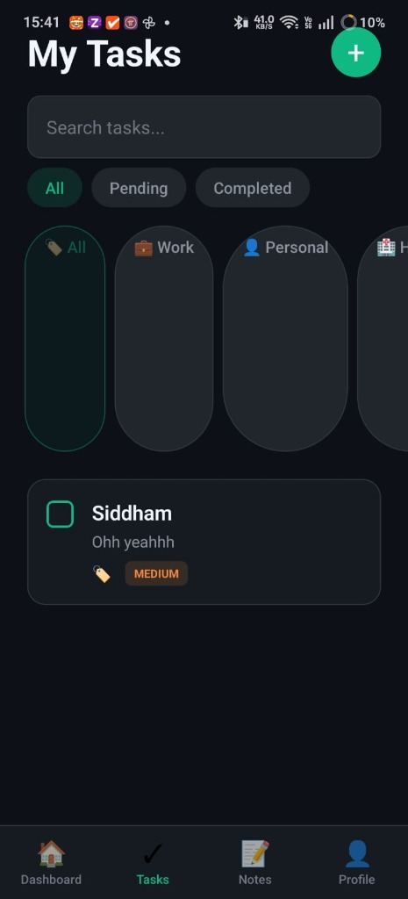

# Smart Productivity App 🚀

A premium full-stack React Native application designed for high-performance task management and organization. Featuring a sleek dark emerald theme, secure authentication, and seamless cloud synchronization.

## 📱 Screenshots

<div align="center">
  
  <p><i>Modern Dark Emerald Dashboard</i></p>
</div>

---

## ✨ Key Features

- **🔐 Secure Authentication**: Robust JWT-based Login and Signup system.
- **📊 Productivity Dashboard**: Get an immediate overview of your tasks, completion rates, and high-priority items.
- **✅ Advanced Task Management**: 
    - Full CRUD functionality for tasks.
    - Priority-based sorting (High, Medium, Low).
    - Category-based organization (Work, Personal, Health, Shopping, Other).
    - Quick toggle completion status.
- **📝 Intelligent Notes System**: 
    - Create standalone notes.
    - Link notes directly to specific tasks for better context.
- **🎨 Premium UI/UX**: Professional dark theme focused on reducing eye strain and enhancing productivity.
- **🔄 Real-time Synchronization**: Frontend and Backend integration for data persistence.

---

## 🛠 Tech Stack

### Frontend
- **Framework**: React Native (Expo SDK 54)
- **Language**: TypeScript
- **Navigation**: React Navigation (Native Stack, Bottom Tabs)
- **Networking**: Axios with Interceptors (for JWT management)
- **Storage**: AsyncStorage for persistent sessions
- **Styling**: Vanilla StyleSheet with a centralized Theme system

### Backend
- **Runtime**: Node.js
- **Framework**: Express.js
- **Database**: MongoDB with Mongoose ODM
- **Security**: JWT (JSON Web Tokens) & Bcryptjs for password hashing
- **Environment**: Dotenv for configuration

---

## 📂 Project Structure

```text
.
├── backend/                # Express Server
│   ├── models/             # Mongoose Schemas (User, Task, Note)
│   ├── routes/             # API Endpoints
│   ├── middleware/         # Auth verification
│   └── server.js           # Entry point
├── frontend/               # React Native App
│   ├── src/
│   │   ├── api/            # API Client & Interceptors
│   │   ├── components/     # Reusable UI Elements (Card, Button, TaskCard)
│   │   ├── context/        # Auth & State Management
│   │   ├── screens/        # Main App Screens
│   │   └── theme/          # Centralized Design Tokens
│   └── App.tsx             # Root Component
└── screenshots/            # App Visuals
```

---

## 🚀 Getting Started

### Prerequisites
- Node.js (v18+)
- Expo Go app on your physical device or an Emulator

### 1. Backend Setup
1. Navigate to the backend directory:
   ```bash
   cd backend
   ```
2. Install dependencies:
   ```bash
   npm install
   ```
3. Create a `.env` file in the root of the backend folder:
   ```env
   PORT=5000
   MONGO_URI=your_mongodb_connection_string
   JWT_SECRET=your_ultra_secure_secret
   ```
4. Start the server:
   ```bash
   npm start
   ```

### 2. Frontend Setup
1. Navigate to the frontend directory:
   ```bash
   cd frontend
   ```
2. Install dependencies:
   ```bash
   npm install
   ```
3. Update the `BASE_URL` in `src/api/client.ts` with your local IP address:
   ```typescript
   const BASE_URL = 'http://YOUR_IP_ADDRESS:5000/api';
   ```
4. Start the app:
   ```bash
   npx expo start
   ```

---

## � API Endpoints

| Method | Endpoint | Description | Auth Required |
| :--- | :--- | :--- | :--- |
| `POST` | `/api/auth/register` | User Signup | No |
| `POST` | `/api/auth/login` | User Login | No |
| `GET` | `/api/tasks` | Get all user tasks | Yes |
| `POST` | `/api/tasks` | Create new task | Yes |
| `PUT` | `/api/tasks/:id` | Update task details | Yes |
| `DELETE` | `/api/tasks/:id` | Delete a task | Yes |
| `GET` | `/api/notes` | Get all notes (optional taskId) | Yes |
| `POST` | `/api/notes` | Create a new note | Yes |

---

## 👨‍💻 Author

Built with ❤️ by your friendly developer. Free to use and modify for learning purposes!
